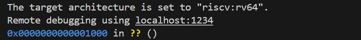
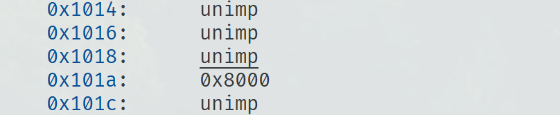
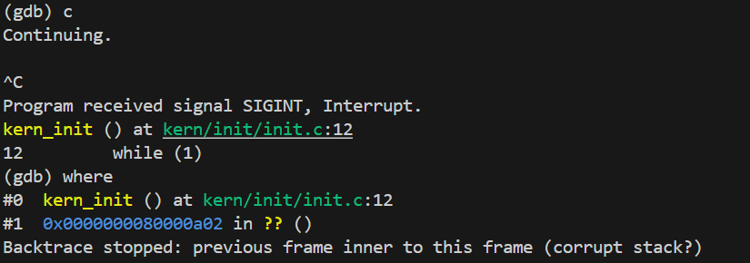
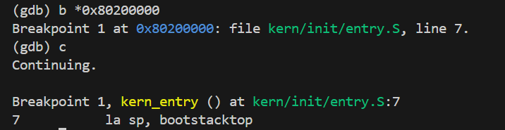

# Lab 1 实验报告

**姓名：** 张奥喆（2313447） 余俊辉（2313486） 杨李泽（2313851）

# 一、理解内核启动中的程序入口操作

`kern/init/entry.S` 代码如下：

```assembly
#include <mmu.h>
#include <memlayout.h>

    .section .text,"ax",%progbits
    .globl kern_entry
kern_entry:
    la sp, bootstacktop

    tail kern_init

.section .data
    # .align 2^12
    .align PGSHIFT
    .global bootstack
bootstack:
    .space KSTACKSIZE
    .global bootstacktop
bootstacktop:
```

## `la sp, bootstacktop` 功能分析

这是一条伪指令，`bootstacktop` 是一个在 .data 段定义的标签，代表内核初始栈的最高地址，而 sp 是栈指针寄存器。所以 `la sp, bootstacktop` 的具体操作就是将内核初始栈的栈顶地址，赋值给栈指针寄存器 sp。

其目的是为内核的 C 语言代码初始化一个可用的栈空间。在操作系统的启动流程中主要有 引导加载程序、进入内核、C 语言的依赖和建立栈 四步，以下是对其的分析。

1. 引导加载程序: 计算机上电后，引导程序会进行一些最基本的硬件初始化，将内核镜像从磁盘加载到内存中，最后跳转到内核的入口点即 `kern_entry` 开始执行。

2. 进入内核 (`kern_entry`): 此时，内核代码刚刚开始执行。在执行这条 la 指令之前，sp 寄存器的值是不确定的，因此需要这条指令来让 sp 指向一个安全的栈。

3. C 语言的依赖: 任何C语言函数的执行都依赖于栈。函数的局部变量、参数传递、返回地址保存等都需要在栈上进行。

4. 建立栈: 因此，在跳转到任何C函数之前，内核必须做的第一件事就是建立自己的栈。代码中 bootstack 定义了 KSTACKSIZE 大小的内存作为内核的第一个栈。由于栈在 RISC-V 上是从高地址向低地址使用的，所以需要将 sp 指向这块内存的最高地址 bootstacktop。

## `tail kern_init` 功能分析

这也是一条伪指令，通常会被汇编器转换成一条无条件跳转指令，会使程序的执行无条件地跳转到 `kern_init` 函数的起始地址。所以 `tail kern_init` 的具体操作是直接跳转到 `kern_init` 函数处开始执行，并且不再返回。

其目的是将处理流程从底层的汇编环境切换到功能更复杂的 C 语言环境。因为在操作系统启动流程中，汇编语言适合处理最底层的硬件初始化，但是操作系统的绝大部分复杂逻辑，如内存管理、进程调度等，用汇编来写是很困难低效的；同时C语言提供了更高级的抽象，是编写操作系统的主要语言；`kern_init` 函数通常是内核中第一个C语言函数，它会接管后续所有的系统初始化工作，例如初始化物理内存管理器和设置内核页表，开启虚拟内存等。

## 内核启动流程总结

可以将这个过程串起来：

1. 引导加载程序: 初始化硬件，加载内核到内存。

2. `kern_entry`: 跳转到内核的第一条指令。此时运行在汇编环境中，没有可用的栈。

3. `la sp, bootstacktop`: 在内存中设置好一块区域作为栈，并让 sp 寄存器指向它。从此，内核有了第一个栈。

4. `tail kern_init`: 跳转到内核的C语言主函数 kern\_init。

5. `kern_init` 执行: 从这里开始，内核的执行流就进入了C语言的世界。它会利用刚刚建立好的栈，开始执行各种复杂的初始化操作，并最终让整个操作系统完全运行起来。

***

# 二、使用GDB验证启动流程

## 实验环境

* **操作系统**：WSL2 + Ubuntu 22.04LTS

* **模拟器**：QEMU 4.1.1

* **交叉编译工具链**： RISC-V GNU Toolchain (riscv64-unknown-elf-gcc 10.2.0, GDB 10.1)

## 调试过程

### 实验原理

在本次实验模拟的 RISC-V 平台中，启动流程主要分为以下几个阶段：

1. **硬件加电与固件执行**：CPU 加电后，从一个固定的复位地址开始执行。该地址指向固件，在我们的环境中由 QEMU 加载的 OpenSBI 扮演此角色。固件负责进行最基础的硬件自检和初始化。

2. **内核加载**：固件完成初始化后，其核心任务之一是找到、加载操作系统的内核镜像文件到内存的指定位置。

3. **控制权移交**：内核加载完毕后，固件执行一条跳转指令，将 CPU 的控制权正式移交给内存中的内核入口点。

4. **内核初始化**：内核开始执行其第一条指令，进行自身的初始化（如设置栈指针），为后续更高级的操作准备环境。

### 定位硬件复位入口点

**调试过程:&#x20;**

1. 在一个终端中通过 `make debug` 命令启动 QEMU，使其加载内核并进入等待调试的状态。

2. 在第二个终端中通过 `make gdb` 命令启动 GDB 调试器，并使其自动连接到正在等待的 QEMU 实例。

3. GDB 成功连接后，程序自动暂停在硬件加电后的第一条指令处。

**GDB 初始连接输出:**



### 分析固件入口指令

**调试过程:**

1. 在 GDB 暂停在 `0x1000` 地址后，我们使用 `p/x $pc` 命令再次确认了程序计数器的位置。

2. 使用 `x/5i $pc` 命令对该地址开始的 5 条指令进行反汇编，以探究其具体功能。

**GDB 反汇编输出:**


我们逐一分析一下这几条加电后最初执行的几条指令：

* `0x1000: auipc t0, 0x0`

  * **作用**：将当前指令的地址（`0x1000`）存入寄存器 `t0`。`auipc` (Add Upper Immediate to PC) 是获取当前位置地址的常用指令。

  * **结果**：`t0` = `0x1000`

* `0x1004: addi a1, t0, 32`

  * **作用**：计算 `t0 + 32`，并将结果存入 `a1`。

* `0x1008: csrr a0, mhartid`

  * **作用**：`csrr` (Control and Status Register Read) 读取当前 CPU 核心的 ID，并存入 `a0` 寄存器。这在多核系统中用于区分是哪个核心在执行代码。

* `0x100c: ld t0, 24(t0)`

  * **作用**：`ld` 从内存中加载一个 8 字节的值到 `t0` 寄存器。

  * **内存地址是哪里？** 地址是 `24 + t0`。因为 `t0` 仍然是 `0x1000`，所以地址是 `0x1000 + 24` = `0x1018`。

  * **加载了什么？** 这条指令会去内存地址 `0x1018` 处，读取 8 个字节的数据。从 GDB 输出可以看到，`0x101a` 处有 `0x8000`，这其实是 8 字节数据 `0x0000000080000000` 的一部分。所以，这条指令执行后，`t0` 寄存器的值就变成了 `0x80000000`，**这正好是 OpenSBI.bin 的地址！**

  

* `0x1010: jr t0`

  * **作用**：`jr` 指令会读取 `t0` 寄存器中的值，并把 PC 设置成这个值。

  * **结果**：因为 `t0` 刚刚被赋值为 `0x80000000`，所以 CPU 会立即跳转到 `0x80000000` 这个地址去执行新的指令。

### 跟踪内核加载与执行

**调试过程:**

1. 我们首先尝试使用 `watch *0x80200000` 命令来捕获内核加载的瞬间。但实验发现，由于 QEMU 的 `-device loader` 预加载机制（在CPU执行前就将内核放入内存），该硬件观察点不会被 CPU 的写入操作触发，程序直接运行至内核末尾的死循环。



2. 因此，我们采用断点法。重启调试会话后，在 GDB 初始暂停在 `0x1000` 时，我们使用 `b *0x80200000` 在内核入口设置断点，然后使用 `c` 命令继续执行，成功地在内核第一条指令处中断。

**GDB 断点命中输出:**



3. 在执行内核代码前，我们检查了CPU的当前状态，以了解从 OpenSBI 固件传递过来的上下文环境。

   * 操作: `i r`

     ```assembly
     (gdb) i r
     sp             0x8001bd80
     a0             0x0
     a1             0x82200000
     pc             0x80200000 <kern_entry>
     ```

   * pc (程序计数器): 其值为 0x80200000，正确指向 `kern_entry`，表明固件已成功跳转到内核。

   * sp (栈顶指针): 其值为 0x8001bd80，这是由 OpenSBI 固件使用的栈。内核在建立自己的栈之前，会暂时继承这个值。

4. 接下来，我们单步执行内核的第一条指令，并验证其效果。

   * 使用 `si` 命令执行一条汇编指令。

   * 再次使用 `i r` 检查寄存器状态。

     ```assembly
     sp             0x80203000       0x80203000 <SBI_CONSOLE_PUTCHAR>
     pc             0x80200004       0x80200004 <kern_entry+4>
     ```

   * **`pc`** 前进了4字节，指向下一条指令，符合预期。

   * **`sp` 寄存器的值发生了决定性的变化**：它从 OpenSBI 的旧值 `0x8001bd80` 更新为 **`0x80203000`**。GDB的符号解析 `<bootstacktop>` 进一步确认了这就是内核预定义的栈顶地址。

     这一“执行前-执行后”的对比清晰地证明了内核的第一条指令 `la sp, bootstacktop` 成功执行，其核心作用是**建立起属于内核自己的、全新的栈空间**。

## 问题回答

**问题一：RISC-V 硬件加电后最初执行的几条指令位于什么地址？**

* 严格来说，硬件加电后执行的**第一条指令**位于物理硬件定义的**复位地址**。在我们调试的 QEMU 平台中，这个地址是 **`0x1000`**。

* 然而，目前这段代码只是一个简单的“跳板”，运行几条指令后，就会跳转到我们所关心的、执行初始化逻辑的主固件（`opensbi.bin`）的第一条指令，位于 **`0x80000000`**。

**问题二：它们主要完成了哪些功能？**

* **位于 `0x1000` 的指令主要功能：**

  * **控制权移交**：执行无条件跳转，将CPU的程序计数器(PC)指向主固件入口地址(`0x80000000`)，这部分内容已在调试过程中分析。

* **位于 `0x80000000` (主固件 `opensbi.bin` 入口) 的指令主要功能：**

  1. **多核引导与角色分配**：读取核心ID(`mhartid`)，区分主核心和从核心。主核心负责初始化，从核心进入等待状态。

  2. **C语言运行环境初始化**：为固件自身的C代码准备执行环境，比如清空BSS段（将未初始化的全局变量置零）和设置栈指针。

  3. **建立陷阱机制**：设置`mtvec`寄存器，指向陷阱处理程序的入口，为后续处理中断、异常和系统调用做好准备。

  4. ......

  5. **跳转到内核**：完成所有设置后，最终通过指令跳转到S-Mode的操作系统内核(`0x80200000`)。

***

# 三、实验知识点梳理与OS原理对应

在本实验中，我们从零开始构建并启动了一个最小化的操作系统内核。这个过程虽然代码量不大，但涉及了从硬件加电到软件执行的多个核心环节。以下是我们对本次实验中重要知识点及其与OS原理对应关系的梳理和理解。

## **特权级**

* 实验中的理解:
  实验指导指出，OpenSBI运行在M模式，而我们的内核运行在S模式。为了在S模式的内核中实现字符输出，我们不能直接操作硬件，而是需要通过 ecall 指令陷入到M模式，调用OpenSBI提供的 SBI\_CONSOLE\_PUTCHAR 服务。我们在 sbi\_call 函数中通过内联汇编精确地设置寄存器功能号和参数来完成这一调用。

* OS 原理中的知识点:
  进程管理PPT中详细讲解了x86、RISC-V、MIPS 的特权级概念。其中提到，为了保护系统，特权指令（比如 I/O 指令）、访问特权数据、以及执行存储在特权区域的代码，只能在更高权限的模式下执行。

* **联系**: 实验中从 S 模式 ecall 到 M 模式调用SBI服务，是OS原理中“特权级切换”概念在 RISC-V 架构下的一个完美实例。它体现了操作系统通过提供服务接口来抽象和保护底层硬件的核心思想。

## **程序的内存布局与链接脚本**

* 实验中的理解:
  我们通过编写链接脚本 tools/kernel.ld，精确地控制了内核的内存布局。我们指定了程序的入口点 kern\_entry，设置了内核的基地址 BASE\_ADDRESS = 0x80200000，并依次排列了代码段 .text、只读数据段 .rodata、数据段 .data 和 .bss 段。entry.S中还定义了内核栈 bootstack。这些都构成了内核静态的内存视图。

* OS 原理中的知识点:
  原理PPT中提到，程序加载到内存后，其地址空间是连续的，并且需要通过重定位来解决地址相关性问题。PPT中也展示了程序在内存中的基本分区，如代码段、数据段和堆栈段，这与我们在链接脚本中定义的段落相对应。

* **联系与差异**:

  * **联系**: 链接脚本是对OS原理中“程序内存模型”的一次具体实践。我们通过它将抽象的代码、数据等概念映射到了具体的虚拟（在此次实验中等同于物理）地址空间上。

  * **差异**: Lab1的内存模型非常初级，属于静态分配。原理课中更重要的内存管理技术，如动态分区分配、虚拟内存等，在本次实验中完全没有体现。我们的内核只有一个地址空间，不存在内外碎片问题，也不需要复杂的分配算法。

***

# 四、 原理中重要但在实验中未体现的知识点

Lab1作为一个“麻雀骨架”，其目标是成功启动并验证最基本的执行环境。因此，目前学到的很多操作系统原理中的核心概念在此阶段并未涉及。

1. **进程管理**

   * **原理描述**: 这是操作系统的核心功能之一，包括进程的抽象（进程控制块PCB）、进程的生命周期（创建、就绪、运行、阻塞、退出等状态）、进程调度（选择哪个进程上CPU）以及上下文切换（保存和恢复进程状态）。

   * **缺失**: Lab1中完全没有“进程”的概念。整个内核是一个单线程的执行流，一旦获得CPU控制权就进入死循环，永不释放。

2. **内存管理**

   * **原理描述**: 现代操作系统使用虚拟内存技术，通过页表或段表将程序的逻辑地址映射到物理地址，从而实现内存保护、共享和空间扩展。当内存不足时，还涉及页面置换算法和换入换出机制 。

   * **缺失**: Lab1的内存模型是“所见即所得”的物理内存模型。链接地址 0x80200000 就是物理地址。没有虚拟地址、MMU地址翻译、页表、TLB、缺页异常处理等高级内存管理机制。我们甚至没有动态内存分配，所有内存都在编译时静态规划好了。

3) **并发与并行**

   * **原理描述**: 操作系统通过在多个进程间快速切换，实现了宏观上的并发执行，从而提高了CPU和I/O设备的利用率。并行则指多个任务在多个CPU核心上同时执行。

   * **实验缺失**: Lab1是纯粹的顺序执行模型，不存在任何并发或并行行为。CPU从头执行到尾，中间没有中断或切换。

总结来说，Lab1让我们聚焦于操作系统与硬件交互的最低层接口，成功地“点燃”了内核。而原理中绝大部分关于“管理”和“抽象”的复杂机制，如管理多个进程、管理有限的内存、处理并发请求等，都有待于我们在后续实验中，在这副“麻雀骨架”上逐步添加血肉来学习和实现。

