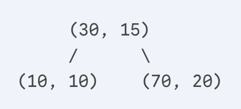
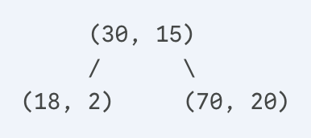

**姓名**： 张奥喆（2313447） 余俊辉（2313486） 杨李泽（2313851）

***

# 练习 1

## 函数作用分析

### `default_init`

```c
static void default_init(void) {
    list_init(&free_list);
    nr_free = 0;
}
```

1. 分析：

`default_init` 函数是物理内存管理器的初始化入口，通过调用 `list_init(&free_list)` 来初始化空闲内存块的双向链表结构，这个链表将作为后续所有内存分配和回收操作的核心数据结构。`list_init` 会将链表头节点的前后指针都指向自身，形成一个标准的空双向链表结构。同时，函数将全局变量 `nr_free` 设置为 0，表示系统初始状态下没有任何可用的空闲物理页。

* 作用：

- 初始化空闲内存管理结构

- 初始化空闲块链表 `free_list`

- 设置空闲页计数器 `nr_free` 为 0

### `default_init_memmap`

```c
static void
default_init_memmap(struct Page *base, size_t n) {
    assert(n > 0);
    struct Page *p = base;
    for (; p != base + n; p ++) {
        assert(PageReserved(p));
        p->flags = p->property = 0;
        set_page_ref(p, 0);
    }
    base->property = n;
    SetPageProperty(base);
    nr_free += n;
    if (list_empty(&free_list)) {
        list_add(&free_list, &(base->page_link));
    } else {
        list_entry_t* le = &free_list;
        while ((le = list_next(le)) != &free_list) {
            struct Page* page = le2page(le, page_link);
            if (base < page) {
                list_add_before(le, &(base->page_link));
                break;
            } else if (list_next(le) == &free_list) {
                list_add(le, &(base->page_link));
            }
        }
    }
}
```

1. 分析：

`default_init_memmap` 函数对一段连续的物理内存页进行初始化并将其纳入内存管理系统的管理范围。该函数接收两个关键参数：`base` 和`n`。`base` 指向连续内存块的起始页面，`n` 表示需要初始化的连续页面数量。

函数首先通过循环遍历这段连续内存中的每一个页面，通过 `PageReserved(p)` 确保每个页面都处于保留状态，然后清除页面的所有标志位和属性值，并将页面的引用计数设置为 0，表示这些页面当前没有被任何进程引用。接下来，函数在内存块的基页上设置 `property = n`，标记整个空闲块的大小，通过 `SetPageProperty(base)` 设置基页的 PG\_property 标志位。最后，函数将初始化好的内存块按照物理地址升序插入到空闲链表中，这种有序排列策略为后续的内存合并操作提供了便利，同时更新系统的空闲页总数 `nr_free`。

* 作用：

- 初始化一段连续的空闲内存页

- 验证页面是否被保留

- 清除页面的标志位和属性，设置引用计数为 0

- 按地址顺序将空闲块插入链表

- 更新空闲页总数

### `default_alloc_pages`

```c
static struct Page *
default_alloc_pages(size_t n) {
    assert(n > 0);
    if (n > nr_free) {
        return NULL;
    }
    struct Page *page = NULL;
    list_entry_t *le = &free_list;
    while ((le = list_next(le)) != &free_list) {
        struct Page *p = le2page(le, page_link);
        if (p->property >= n) {
            page = p;
            break;
        }
    }
    if (page != NULL) {
        list_entry_t* prev = list_prev(&(page->page_link));
        list_del(&(page->page_link));
        if (page->property > n) {
            struct Page *p = page + n;
            p->property = page->property - n;
            SetPageProperty(p);
            list_add(prev, &(p->page_link));
        }
        nr_free -= n;
        ClearPageProperty(page);
    }
    return page;
}
```

1. 分析：

`default_alloc_pages` 函数实现了 first-fit 内存分配策略的核心逻辑。函数首先检查请求的页数 `n` 是否超过系统当前的空闲页总数，如果不足则返回 NULL。接着，函数从空闲链表头部开始遍历，采用经典的 first-fit 算法查找第一个大小满足需求的空闲块，即第一个 `property >= n` 的内存块。一旦找到合适的空闲块，函数会立即将该块从空闲链表中移除，然后判断是否需要执行块分割操作：如果找到的块大小正好等于请求大小，则直接分配整个块；如果块大小大于请求大小，则进行精细的分割处理，将前 `n` 页分配给请求者，剩余部分作为一个新的空闲块重新插入到链表的原始位置。在分配过程中，函数会更新系统的空闲页计数 `nr_free`，并清除分配页面的 PG\_property 标志位，表明这些页面已被分配使用。

* 作用：

- 分配 n 个连续的物理页

- 遍历空闲链表，找到第一个大小 ≥ n 的块

- 如果找到合适块，从链表中移除该块；如果块大小 > n，分割剩余部分重新插入链表。更新空闲页计数，清除分配页的 property 标志

- 返回分配页的基地址

### `default_free_pages`

```c
static void
default_free_pages(struct Page *base, size_t n) {
    assert(n > 0);
    struct Page *p = base;
    for (; p != base + n; p ++) {
        assert(!PageReserved(p) && !PageProperty(p));
        p->flags = 0;
        set_page_ref(p, 0);
    }
    base->property = n;
    SetPageProperty(base);
    nr_free += n;

    if (list_empty(&free_list)) {
        list_add(&free_list, &(base->page_link));
    } else {
        list_entry_t* le = &free_list;
        while ((le = list_next(le)) != &free_list) {
            struct Page* page = le2page(le, page_link);
            if (base < page) {
                list_add_before(le, &(base->page_link));
                break;
            } else if (list_next(le) == &free_list) {
                list_add(le, &(base->page_link));
            }
        }
    }

    list_entry_t* le = list_prev(&(base->page_link));
    if (le != &free_list) {
        p = le2page(le, page_link);
        if (p + p->property == base) {
            p->property += base->property;
            ClearPageProperty(base);
            list_del(&(base->page_link));
            base = p;
        }
    }

    le = list_next(&(base->page_link));
    if (le != &free_list) {
        p = le2page(le, page_link);
        if (base + base->property == p) {
            base->property += p->property;
            ClearPageProperty(p);
            list_del(&(p->page_link));
        }
    }
}
```

1. 分析：

`default_free_pages` 函数实现了内存回收和碎片整理，负责将已使用的连续物理页释放回空闲链表并优化内存布局。函数首先验证要释放的页面既不是保留页也不是已空闲页，然后重置这些页面的所有状态信息，包括清除标志位和将引用计数归零。接着，函数在基页上重新建立空闲块信息，设置 `property = n` 并标记 PG_property 标志位，然后将这个新释放的块按照物理地址顺序插入到空闲链表中。
最关键的部分是相邻块合并操作：函数会检查刚插入的块是否与前后相邻的空闲块地址连续，如果发现前一个空闲块的结束地址正好等于当前块的起始地址，则执行向前合并，将当前块合并到前一个块中；同样，如果当前块的结束地址正好等于后一个空闲块的起始地址，则执行向后合并，将后一个块合并到当前块中。这种双向合并机制有效地减少了外部碎片问题，将小的空闲块合并成大的连续空间，提高了内存的利用率和后续分配的效率。

* 作用：

- 释放 n 个连续的物理页

- 初始化释放的页面

- 设置基页的 property 为 n，标记为可用

- 按地址顺序插入空闲链表

## 物理内存分配过程

1. 初始化阶段：系统启动时初始化所有可用物理页

2. 分配请求：程序请求 n 个连续页时，从链表头开始查找第一个满足条件的块

3. 块分割：如果找到的块比需求大，分割并保留剩余部分

4. 释放回收：释放页面时插入链表并尝试合并相邻块

5. 合并优化：前后合并减少外部碎片

## 改进空间分析

1. 使用 AVL 树代替简单链表

不再使用一个简单的双向链表 `free_list` 来存储所有空闲块，而是使用一个按物理地址排序的 AVL 树来管理这些空闲块。树的每个节点代表一个空闲内存块，记录了块的起始地址、大小等信息。



分配时，我们需要对树进行中序遍历。我们从树中物理地址最小的节点开始进行中序遍历，访问每一个空闲块，直到找到第一个大小 `size >= n` 的块。这保证了我们找到的永远是符合条件的、地址最低的那个块。


释放时，用 $$O(\log N)$$ 的时间复杂度快速找到需要插入新释放块的位置，以及它的前驱（地址比它小的最大块）和后继（地址比它大的最小块）。然后，我们检查是否可以与前驱和后继进行合并。

`alloc(8)` 后的 AVL 树：




* 分离空闲链表

这种方法维护一个空闲链表的数组，数组中的每一个元素都是一个独立的链表，负责管理特定大小的空闲块。比如：

`free_list_array[0]`: 管理大小为 1 页的空闲块。

`free_list_array[1]`: 管理大小为 2 页的空闲块。

`free_list_array[2]`: 管理大小为 3-4 页的空闲块。

`free_list_array[3]`: 管理大小为 5-8 页的空闲块。

...

当需要分配 `n` 个页时，算法不再从头扫描一个巨大的链表。首先根据 `n` 的大小，直接定位到合适的链表。例如，请求分配6个页，算法会直接去查找`free_list_array[3]`。然后，在这个更短、更相关的链表上执行 First-Fit 搜索，找到地址最小的块。

***

# 练习 2

## **设计实现过程**

Best-Fit（最佳适应）算法的核心思想是在分配内存时，从所有可用的空闲内存块中，选择一个大小最接近请求大小且满足需求的内存块进行分配。这种策略旨在最大限度地减少因分割大内存块而产生的外部碎片，从而提高内存的利用率。

实验代码已经提供了 First-Fit 的代码， `default_pmm.c` 中 First-Fit 算法的框架，基于一个双向链表来管理所有的空闲内存块。每个链表节点代表一个连续的空闲物理内存块，其起始页的 `property` 字段记录了该块包含的连续页框数量。经过分析可以发现，除了 Best-Fit 的 `alloc_pages` 函数和 First-Fit 有区别，其他的内容可以借鉴 First-Fit。

**数据结构:**

与 First-Fit 类似，我使用了 `free_area_t` 结构来管理空闲内存：

```c++
static free_area_t free_area;
#define free_list (free_area.free_list)
#define nr_free (free_area.nr_free)
```

* `free_list`：一个双向链表头，用于串联起所有的空闲内存块。

* `nr_free`：一个全局变量，记录当前系统中所有空闲页的总数。

**算法流程:**

1. **初始化** (`best_fit_init`, `best_fit_init_memmap`):
   这部分与 `default_pmm.c` 的实现一致。`best_fit_init` 负责初始化空闲链表和计数器。`best_fit_init_memmap` 则将初始的物理内存区域作为一个大的空闲块，并按照物理地址升序的方式插入到 `free_list` 中。

2. **内存分配** `(best_fit_alloc_pages)`:
   这是 Best-Fit 算法与 First-Fit 算法的核心区别所在。当收到分配 n 个页框的请求时：

   * 算法**必须完整遍历整个 `free_list`**，而不是像 First-Fit 那样找到第一个满足条件的块就停止。

   * 在遍历过程中，使用一个指针 `page` 和一个变量 `min_size` 来追踪“最佳”选择。`page` 记录当前找到的最小且能满足需求的空闲块，而 `min_size` 记录该块的大小。

   * 每当找到一个比当前 `min_size` 更小但仍然大于等于 n 的空闲块时，就更新 `page` 和 `min_size`。

   * 遍历结束后，`page` 指向的就是最适合的内存块。

   * 后续的分割操作（如果找到的块大于所需大小）和更新 `nr_free` 计数与 First-Fit 相同。

3) **内存释放** (`best_fit_free_pages`):
   这部分的实现也与 `default_pmm.c` 完全一致。当一个内存块被释放时，它会被重新插入到 `free_list` 中，并立即尝试与其前后物理地址相邻的空闲块进行合并。这个合并逻辑对于保证内存的连续性至关重要，与采用何种分配策略无关。

## **代码实现阐述**

**内存分配&#x20;**(`best_fit_alloc_pages`)

Best-Fit 必须遍历整个链表，以确保找到的是“最小的”满足条件的块。

```c++
static struct Page *
best_fit_alloc_pages(size_t n) {
    assert(n > 0);
    if (n > nr_free) {
        return NULL;
    }
    struct Page *page = NULL;
    list_entry_t *le = &free_list;
    // 初始化min_size为一个不可能达到的最大值，用于寻找最小的合适块
    size_t min_size = nr_free + 1;

    // 完整遍历空闲链表以找到最佳匹配
    while ((le = list_next(le)) != &free_list) {
        struct Page *p = le2page(le, page_link);
        if (p->property >= n) {
            // 如果当前块满足需求，并且比之前找到的最小块还要小
            if (p->property < min_size) {
                // 更新最佳选择
                page = p;
                min_size = p->property;
            }
        }
    }

    if (page != NULL) {
        // ... (分割和更新链表的操作，与First-Fit类似)
        list_entry_t* prev = list_prev(&(page->page_link));
        list_del(&(page->page_link));
        if (page->property > n) {
            struct Page *p = page + n;
            p->property = page->property - n;
            SetPageProperty(p);
            list_add(prev, &(p->page_link));
        }
        nr_free -= n;
        ClearPageProperty(page);
    }
    return page;
}
```

**内存释放** (`best_fit_free_pages`)

释放过程的逻辑与 First-Fit 完全相同。关键在于将释放的内存块插入到链表的正确位置（按地址排序），并尝试与相邻的空闲块合并，以形成更大的连续空闲空间。

```c++
static void
best_fit_free_pages(struct Page *base, size_t n) {
    assert(n > 0);
    struct Page *p = base;
    // 初始化待释放的页
    for (; p != base + n; p ++) {
        assert(!PageReserved(p) && !PageProperty(p));
        p->flags = 0;
        set_page_ref(p, 0);
    }
    
    // 设置新空闲块的属性
    base->property = n;
    SetPageProperty(base);
    nr_free += n;

    // 按地址有序插入链表
    list_entry_t* le = &free_list;
    while ((le = list_next(le)) != &free_list) {
        struct Page* page = le2page(le, page_link);
        if (base < page) {
            list_add_before(le, &(base->page_link));
            break;
        } else if (list_next(le) == &free_list) {
            list_add(le, &(base->page_link));
        }
    }

    // 尝试向前合并
    le = list_prev(&(base->page_link));
    if (le != &free_list) {
        p = le2page(le, page_link);
        if (p + p->property == base) {
            p->property += base->property;
            ClearPageProperty(base);
            list_del(&(base->page_link));
            base = p;
        }
    }

    // 尝试向后合并
    le = list_next(&(base->page_link));
    if (le != &free_list) {
        p = le2page(le, page_link);
        if (base + base->property == p) {
            base->property += p->property;
            ClearPageProperty(p);
            list_del(&(p->page_link));
        }
    }
}
```

## 测试 & 实验结果

使用提供的评测脚本 `make grade`，我们的 Best-Fit 代码通过了评测：

```plain&#x20;text
root@workingPC:/home/lab2# make grade
>>>>>>>>>> here_make>>>>>>>>>>>
gmake[1]: Entering directory '/home/lab2' + cc kern/init/entry.S + cc kern/init/init.c + cc kern/libs/stdio.c + cc kern/debug/panic.c + cc kern/driver/console.c + cc kern/driver/dtb.c + cc kern/mm/best_fit_pmm.c + cc kern/mm/buddy_pmm.c + cc kern/mm/default_pmm.c + cc kern/mm/pmm.c + cc kern/mm/slub_pmm.c + cc libs/printfmt.c + cc libs/readline.c + cc libs/sbi.c + cc libs/string.c + ld bin/kernel riscv64-unknown-elf-objcopy bin/kernel --strip-all -O binary bin/ucore.img gmake[1]: Leaving directory '/home/lab2'
>>>>>>>>>> here_make>>>>>>>>>>>
<<<<<<<<<<<<<<< here_run_qemu <<<<<<<<<<<<<<<<<<
try to run qemu
qemu pid=50293
<<<<<<<<<<<<<<< here_run_check <<<<<<<<<<<<<<<<<<
  -check physical_memory_map_information:    OK
  -check_best_fit:                           OK
Total Score: 25/25
```

## Best-Fit 算法的进一步改进空间

经过思考，我实现的 Best-Fit 算法存在改进空间，主要集中在性能方面：

1. **性能开销**：当前实现的 `best_fit_alloc_pages` 函数为了找到“最佳”块，每次都需要遍历整个空闲链表。当系统长时间运行，内存碎片化导致链表变长时，这个遍历过程会成为一个显著的性能瓶颈，其时间复杂度为 $$O(N)$$，其中 $$N$$ 是空闲块的数量。

2. **改进方向——多链表**：

   * 可以借鉴更高级的分配器思想，使用多个链表来管理不同大小范围的空闲块。例如，可以创建一个链表数组 `free_list[i]`，其中 `free_list[0]` 管理大小为1的块，`free_list[1]` 管理大小为2的块，`free_list[2]` 管理大小为3-4的块，以此类推。

   * 当需要分配大小为 `n` 的内存时，可以直接去对应或稍大范围的链表中查找。这大大缩小了搜索范围。如果找不到，再向更大范围的链表寻找并进行分割。

   * 它将查找时间从 $$O(N)$$ 降低到接近 $$O(1)$$

综上所述，虽然我实现的 Best-Fit 算法在功能上是正确的，并且通过了测试，但从性能和碎片管理的长远角度看，可以通过引入更高效的数据结构（如多链表、平衡二叉搜索树等）来组织空闲块，从而显著提升分配效率。

***

# 扩展练习 Challenge: buddy system

## Buddy\_System 原理解构

伙伴系统（Buddy System）是一种经典的动态内存分配算法，它旨在高效地管理物理内存，并有效控制**外部碎片**问题。与简单的连续分配策略不同，伙伴系统的核心思想是将整个可管理内存空间构建成一种易于分裂与合并的结构化形式。

### 内存块的 2 的幂次原则

伙伴系统将全部可用物理内存视为一个大的内存块，其总大小被规整为2的幂（例如，如果有30KB可用内存，系统会将其视为一个32KB的块进行管理）。所有的内存分配与释放都基于大小为 2^k（k为整数，称为**阶数(order)**）的内存块进行。例如，内存块的大小可以是1页、2页、4页、8页... 直至整个内存大小。当一个程序请求一块内存时，系统会分配一个大小最接近且不小于请求大小的 2^k 块。

### “伙伴”的定义

**伙伴（Buddy）** 是该算法的基石。当一个大小为 2^{k+1} 的内存块被精确地**对半分裂**后，产生的两个大小为 2^k 的子块，彼此互称为“伙伴”。一对伙伴具有以下严格的特性：

* **大小相同**：它们的阶数（order）和大小完全一致。

* **物理相邻**：它们在物理内存地址上是连续的。

* **共同来源**：它们是由同一个更大的父块分裂而来。

* **可合并性**：只有互为伙伴的两个块，并且都处于空闲状态时，才能被合并成原来的那一个父块。

* **地址的数学关系**：一个块和其伙伴的起始地址之间存在着精确的数学关系。一个大小为 2^k（阶数为k）的块，其伙伴的地址可以通过将它自己的起始页号与 2^k 进行**按位异或（XOR）**&#x8FD0;算快速得到。这个特性使得伙伴的定位极为高效。

### 分裂与合并机制

伙伴系统的整个周期都围绕着块的分裂与合并进行。

* **分裂 (Splitting)**：这是一个“自顶向下”的过程。当需要分配一块内存时：

  1. 系统首先计算出满足请求所需的最小阶数 `k`。

  2. 然后从阶数为 `k` 的空闲链表开始查找。

  3. 如果找不到，就去更高一阶 `k+1` 的链表中查找。

  4. 如果找到了一个 `k+1` 阶的块，系统就将其分裂成两个 `k` 阶的伙伴。一个用于分配，另一个则被放入 `k` 阶的空闲链表中。这个过程可以递归进行，直到找到或创建出所需大小的块。

* **合并 (Merging)**：这是一个“自底向上”的过程。当一个内存块被释放时：

  1. 系统首先通过其地址和阶数，利用XOR运算找到其伙伴。

  2. 然后检查该伙伴是否也处于空闲状态，并且阶数与自己相同。

  3. 如果满足合并条件，系统就将这两个伙伴合并成一个阶数加一的父块。

  4. 这个合并过程会递归进行，新合并的父块会继续尝试与它的伙伴合并，直到遇到一个已被占用的伙伴或达到最大内存阶数为止。

## 代码设计

为了在 ucore 操作系统中集成伙伴系统，我们遵循了其原有的物理内存管理（PMM）框架。我们创建了一个新的管理器 `buddy_pmm_manager`，并为其设计了特定的数据结构和函数实现。

### 数据结构设计

伙伴系统的核心在于如何高效地组织和追踪不同大小的空闲内存块。为此，我们对 ucore 原有的内存管理结构进行了适配和拓展。

**`free_area_t` 空闲链表数组**

我们并未使用单一的空闲链表，而是定义了一个由 `free_area_t` 组成的数组：

```c
static free_area_t free_area[MAX_ORDER];
```

* 这是一个大小为 `MAX_ORDER` (在我们的实现中通常为15) 的数组，它构成了伙伴系统的骨架。

* 数组的每一个元素 `free_area[i]` 都是一个独立的空闲块链表，专门用于管理所有阶数为 `i`（即大小为 2^i 个页面）的空闲块。

* 通过这种方式，查找特定大小的空闲块变得非常高效：我们只需直接访问对应阶数的链表即可，无需遍历不相关大小的块。

**`struct Page` 页面描述符的拓展**

我们利用 ucore 中已有的 `struct Page` 结构，并赋予其部分成员新的含义以支持伙伴系统：

```c
struct Page {
    int ref;
    uint64_t flags;
    unsigned int property;   // 用于存储块的阶数 (order)
    list_entry_t page_link;  // 用于链接到 free_area 链表
};
```

* **`page_link`**: `list_entry_t` 类型的链表节点。当一个内存块空闲时，其**头页面**的 `page_link` 成员会被用来将该块链入 `free_area` 数组中对应阶数的空闲链表。

* **`property`**: 这个字段是伙伴系统实现中的**关键**。我们用它来存储一个内存块的**阶数 (order)**，对于一个**已分配**的块，其头页面的 `property` 记录了该块被分配时的阶数。这在释放时至关重要，因为函数需要知道要释放的块的真实大小。对于一个**空闲**块，其头页面的 `property` 同样记录了其阶数。这在合并时用于检查伙伴块的大小是否匹配。

* **`flags` 中的 `PG_property` 位**: 这个标志位被用作一个布尔开关，用于标记一个 `Page` 结构体是否是一个**空闲块的头部**。当一个块被加入到空闲链表时，`SetPageProperty()` 宏会设置其头页面的 `PG_property` 位。在尝试合并时，`PageProperty(buddy)` 宏会检查伙伴块的这个标志位，从而快速判断伙伴是否空闲且可用于合并。

### 函数设计

基于上述数据结构，我们设计了初始化、分配和释放三大核心函数。

**初始化 Buddy\_System (`buddy_init` & `buddy_init_memmap`)**

初始化的过程分为两步：

1. **`buddy_init()`**: 这个函数负责进行最基础的“冷启动”。它遍历整个 `free_area` 数组，将每一个阶数的空闲链表都初始化为空，并将空闲块计数器清零。

```c
static void buddy_init(void) {
    for (int i = 0; i < MAX_ORDER; i++) {
        list_init(&(free_area[i].free_list));
        free_area[i].nr_free = 0;
    }
    nr_free = 0;
}
```

* **`buddy_init_memmap(struct Page *base, size_t n)`**: 这个函数接收由 `pmm_init` 探测到的、所有可用的连续物理内存（由起始 `Page` 指针 `base` 和总页数 `n` 描述）。它的任务是将这块“原始”内存组织成伙伴系统的结构：

- 首先，清理这 `n` 个页面的所有 `Page` 结构体状态。

- 然后，采用“贪心”策略，从 `base` 开始，循环地从剩余的内存中“切”出最大的、可能的2的幂次大小的块。

- 每切出一个块，就将其头页面的 `property` 设置为对应的阶数，并将其链入 `free_area` 数组中正确的空闲链表。

- 这个过程持续进行，直到所有 `n` 页内存都被组织成不同大小的空闲块，完成了系统的初始状态构建。

```c
static void buddy_init_memmap(struct Page *base, size_t n) {
    assert(n > 0);
    // 将所有页面标记为可用
    for (struct Page *p = base; p < base + n; p++) {
        assert(PageReserved(p));
        p->flags = 0;
        p->property = 0; 
        set_page_ref(p, 0);
    }
    size_t total_pages = n;
    struct Page *p = base;
    // 将大块内存切分成 2^k 大小的块，并加入相应的空闲链表
    while (total_pages > 0) {
        size_t order = 0;
        // 找到能放入剩余空间的最大阶数
        while (order + 1 < MAX_ORDER && (1 << (order + 1)) <= total_pages) {
            order++;
        }
        // 将这个最大块的头页面加入对应阶数的空闲链表
        list_add(&(free_area[order].free_list), &(p->page_link));
        free_area[order].nr_free++;
        nr_free += (1 << order);
        // 标记块头页的阶数，并设置其为空闲块头标志
        p->property = order;
        SetPageProperty(p); // 标记它是一个空闲块的头部
        p += (1 << order);
        total_pages -= (1 << order);
    }
}
```

**分配页面 (`buddy_alloc_pages`)**

此函数实现了伙伴系统的“分裂”逻辑，为用户请求分配内存。

1. **计算阶数**: 首先，根据请求的页面数 `n`，调用 `get_order(n)` 向上取整，计算出能满足需求的最小阶数 `order`。

2. **查找空闲块**: 从 `free_area[order]` 开始，向上遍历空闲链表数组，寻找第一个非空的链表。这确保了我们能找到满足需求的、且大小最接近的可用块。

3. **递归分裂**: 如果找到的块（阶数为 `current_order`）比需求的块（阶数为 `order`）大，函数会进行递归分裂。它将大块对半切分，将其中一个伙伴（地址较大的那一半）链入 `current_order - 1` 阶的空闲链表，然后继续对另一半进行分裂，直到得到一个与 `order` 阶数相匹配的块。

4. **返回内存**: 最终得到的 `order` 阶块被从空闲链表中移除，其头页面的 `PG_property` 标志位被清除（表示不再是空闲块头），然后返回给调用者。全局空闲页数 `nr_free` 也相应减少。

```c
static struct Page *buddy_alloc_pages(size_t n) {
    if (n == 0) return NULL;
    if (n > nr_free) return NULL;
    // 计算所需最小阶数
    uint32_t order = get_order(n);
    uint32_t current_order;
    // 从所需阶数开始，向上查找可用的更大块
    for (current_order = order; current_order < MAX_ORDER; current_order++) {
        if (!list_empty(&(free_area[current_order].free_list))) {
            break;
        }
    }
    if (current_order == MAX_ORDER) { // 没找到
        return NULL;
    }
    // 从找到的空闲链表中取出一个块
    list_entry_t *le = list_next(&(free_area[current_order].free_list));
    struct Page *page = le2page(le, page_link);
    list_del(le);
    free_area[current_order].nr_free--;
    // 如果找到的块比需要的大，则进行切分
    while (current_order > order) {
        current_order--;
        // 切分后的另一半（伙伴）
        struct Page *buddy = page + (1 << current_order);
        buddy->property = current_order; // 记录伙伴的阶数
        list_add(&(free_area[current_order].free_list), &(buddy->page_link));
        free_area[current_order].nr_free++;
    }
    // 标记分配出去的块为非空闲，并记录其阶数
    ClearPageProperty(page); 
    page->property = order;
    nr_free -= (1 << order);    
    return page;
}
```

**释放页面 (`buddy_free_pages`)**

此函数实现了伙伴系统的“合并”逻辑，回收内存并对抗碎片。

1. **状态恢复**: 函数首先从待释放块的头页面 `base->property` 中获取其真实的阶数 `order`。然后将这整个块的所有页面状态（flags, ref）重置。并在函数开头就将释放的页面数 `(1 << order)` 加回到全局计数器 `nr_free`，确保了记账的准确性。

2. **循环合并**: 这是函数的核心。在一个 `while` 循环中：

   * **定位伙伴**: 通过 `buddy_idx = page_idx ^ (1 << order)` 的位运算，计算出当前块的伙伴地址。

   * **检查伙伴**: 严格检查伙伴是否**同时满足**两个条件：是一个空闲块的头（`PageProperty(buddy)` 为真），并且与当前块的阶数相同（`buddy->property == order`）。

   * **执行合并**: 如果条件满足，就将伙伴从其空闲链表中移除，然后将两个块合并成一个阶数加一的父块。并更新 `base` 指针，使其指向新块的起始（地址较小）位置。

   * **继续循环**: `order` 递增，循环继续，尝试将这个新合并的、更大的块与它的新伙伴进行下一轮合并。

   * **终止**: 如果伙伴不满足合并条件，或已达到最大阶数，循环终止。

3. **最终入队**: 循环结束后，将最终形成的（可能经过多次合并的）大块，根据其最终的阶数 `order`，链入 `free_area` 中对应的空闲链表。

```c
static void buddy_free_pages(struct Page *base, size_t n) {
    assert(n > 0);
    // 获取阶数
    uint32_t order = base->property;
    // 当前被释放的块增加空闲页计数
    nr_free += (1 << order);
    struct Page *p = base;
    // 将释放的页面标记为非保留和非分配状态
    for (; p != base + (1 << order); p++) {
        assert(!PageReserved(p));
        p->flags = 0;
        set_page_ref(p, 0);
    }
    // 开始循环合并
    while (order < MAX_ORDER - 1) {
        uintptr_t page_idx = page2ppn(base);
        uintptr_t buddy_idx = page_idx ^ (1 << order);
        struct Page *buddy = pa2page(buddy_idx * PGSIZE);
        // 检查伙伴是否是空闲块的头，并且阶数相同
        if (!PageProperty(buddy) || buddy->property != order) {
            break; // 不满足合并条件，跳出循环
        }
        // 从空闲链表中移除伙伴，准备合并
        list_del(&(buddy->page_link));
        free_area[order].nr_free--;
        ClearPageProperty(buddy); // 伙伴不再是空闲块头
        // 更新基地址，确保 base 指向地址较小的那个页
        if (buddy < base) {
            base = buddy;
        }
        // 阶数加一，进入下一轮合并尝试
        order++;
    }
    // 将最终的块（可能已合并）加入到正确的空闲链表中
    base->property = order;
    SetPageProperty(base); // 标记它是一个新的空闲块头
    list_add(&(free_area[order].free_list), &(base->page_link));
    free_area[order].nr_free++;
}
```

## 测试样例设计

为了全面验证伙伴系统实现的正确性、健壮性以及核心机制（分裂与合并）的有效性，我们设计了一套包含五个关键测试用例的验证程序 `buddy_check`。该程序在内核初始化阶段由 `pmm_init` 调用，通过一系列 `assert` 断言来确保每一步操作的结果都符合预期。同时，我们引入了一个辅助函数 `show_buddy_info`，用于在关键节点可视化地打印出 `free_area` 空闲链表数组的状态，从而直观地展示内存块的动态变化。

### 简单的分配和释放操作

此测试旨在验证分配器最基本的功能——分配一个中等大小的内存块并能正确地将其完全释放。

```c
cprintf("1. 简单的分配和释放操作\n");
    show_buddy_info("初始状态");
    struct Page *p1 = alloc_pages(16);
    show_buddy_info("分配 16 页后");
    assert(p1 != NULL);
    assert(buddy_nr_free_pages() == initial_free - 16);
    cprintf("   - 已分配 16 页。通过。\n");

    free_pages(p1, 16);
    show_buddy_info("释放 16 页后");
    assert(buddy_nr_free_pages() == initial_free);
    cprintf("   - 已释放 16 页。通过。\n");
```

测试首先调用 `alloc_pages(16)` 请求一个16页（阶数4）的块。`show_buddy_info` 的输出清晰地显示，在分配后，阶数4的空闲链表中的一个块被移除。
随后，`free_pages` 被调用以归还该块，输出日志再次确认，阶数4的空闲链表中重新出现了一个空闲块，且系统整体的空闲页状态恢复到了初始值。`assert` 断言确保了全局空闲页计数器 `nr_free` 在此过程中的记账是准确的。

```plain&#x20;text
=== 开始伙伴系统测试 ===
初始空闲页数: 31929

1. 简单的分配和释放操作
   --- 初始状态 ---
     阶数  0 (大小    1): 1 个空闲块
     阶数  3 (大小    8): 1 个空闲块
     阶数  4 (大小   16): 1 个空闲块
     阶数  5 (大小   32): 1 个空闲块
     阶数  7 (大小  128): 1 个空闲块
     阶数 10 (大小 1024): 1 个空闲块
     阶数 11 (大小 2048): 1 个空闲块
     阶数 12 (大小 4096): 1 个空闲块
     阶数 13 (大小 8192): 1 个空闲块
     阶数 14 (大小 16384): 1 个空闲块
   --------------------------------
   --- 分配 16 页后 ---
     阶数  0 (大小    1): 1 个空闲块
     阶数  3 (大小    8): 1 个空闲块
     阶数  5 (大小   32): 1 个空闲块
     阶数  7 (大小  128): 1 个空闲块
     阶数 10 (大小 1024): 1 个空闲块
     阶数 11 (大小 2048): 1 个空闲块
     阶数 12 (大小 4096): 1 个空闲块
     阶数 13 (大小 8192): 1 个空闲块
     阶数 14 (大小 16384): 1 个空闲块
   --------------------------------
   - 已分配 16 页。通过。
   --- 释放 16 页后 ---
     阶数  0 (大小    1): 1 个空闲块
     阶数  3 (大小    8): 1 个空闲块
     阶数  4 (大小   16): 1 个空闲块
     阶数  5 (大小   32): 1 个空闲块
     阶数  7 (大小  128): 1 个空闲块
     阶数 10 (大小 1024): 1 个空闲块
     阶数 11 (大小 2048): 1 个空闲块
     阶数 12 (大小 4096): 1 个空闲块
     阶数 13 (大小 8192): 1 个空闲块
     阶数 14 (大小 16384): 1 个空闲块
   --------------------------------
   - 已释放 16 页。通过。
```

### 复杂的分配和释放操作

此测试模拟更真实的内存使用场景，通过分配多个不同大小的块并以乱序方式释放，重点考察伙伴系统的合并逻辑在非理想情况下的正确性。

```c
cprintf("2. 复杂的分配和释放操作\n");
    show_buddy_info("初始状态");
    struct Page *p2 = alloc_pages(3);  // 消耗4页
    show_buddy_info("分配 3 页后");
    struct Page *p3 = alloc_pages(10); // 消耗16页
    show_buddy_info("分配 10 页后");
    assert(p2 != NULL && p3 != NULL);
    assert(buddy_nr_free_pages() == initial_free - 4 - 16);
    cprintf("   - 已分配 3 页块 (实际消耗 4 页) 和 10 页块 (实际消耗 16 页)。通过。\n");
        // 逆序释放,测试合并逻辑
    free_pages(p3, 10);
    show_buddy_info("释放 10 页后");
    assert(buddy_nr_free_pages() == initial_free - 4);
    cprintf("   - 已释放 10 页块。通过。\n");
    
    free_pages(p2, 3);
    show_buddy_info("释放 3 页后");
    assert(buddy_nr_free_pages() == initial_free);
    cprintf("   - 已释放 3 页块。通过。\n");
```

程序首先请求了3页和10页的内存，由于伙伴系统的2的幂次原则，系统实际分配了4页（阶数2）和16页（阶数4）的块。日志显示，为满足4页的请求，一个8页的块被分裂。
测试的重点在于逆序释放：先释放16页的块，日志显示阶数4的空闲块被归还；再释放4页的块，日志显示阶数2的空闲块被归还，并且由于其伙伴并未空闲，没有发生合并。最终，`assert` 确认所有内存被完全回收，证明即使释放顺序与分配顺序不同，系统的合并算法依然能够正确工作，避免内存泄漏。

```plain&#x20;text
2. 复杂的分配和释放操作
   --- 初始状态 ---
     阶数  0 (大小    1): 1 个空闲块
     阶数  3 (大小    8): 1 个空闲块
     阶数  4 (大小   16): 1 个空闲块
     阶数  5 (大小   32): 1 个空闲块
     阶数  7 (大小  128): 1 个空闲块
     阶数 10 (大小 1024): 1 个空闲块
     阶数 11 (大小 2048): 1 个空闲块
     阶数 12 (大小 4096): 1 个空闲块
     阶数 13 (大小 8192): 1 个空闲块
     阶数 14 (大小 16384): 1 个空闲块
   --------------------------------
   --- 分配 3 页后 ---
     阶数  0 (大小    1): 1 个空闲块
     阶数  2 (大小    4): 1 个空闲块
     阶数  4 (大小   16): 1 个空闲块
     阶数  5 (大小   32): 1 个空闲块
     阶数  7 (大小  128): 1 个空闲块
     阶数 10 (大小 1024): 1 个空闲块
     阶数 11 (大小 2048): 1 个空闲块
     阶数 12 (大小 4096): 1 个空闲块
     阶数 13 (大小 8192): 1 个空闲块
     阶数 14 (大小 16384): 1 个空闲块
   --------------------------------
   --- 分配 10 页后 ---
     阶数  0 (大小    1): 1 个空闲块
     阶数  2 (大小    4): 1 个空闲块
     阶数  5 (大小   32): 1 个空闲块
     阶数  7 (大小  128): 1 个空闲块
     阶数 10 (大小 1024): 1 个空闲块
     阶数 11 (大小 2048): 1 个空闲块
     阶数 12 (大小 4096): 1 个空闲块
     阶数 13 (大小 8192): 1 个空闲块
     阶数 14 (大小 16384): 1 个空闲块
   --------------------------------
   - 已分配 3 页块 (实际消耗 4 页) 和 10 页块 (实际消耗 16 页)。通过。
   --- 释放 10 页后 ---
     阶数  0 (大小    1): 1 个空闲块
     阶数  2 (大小    4): 1 个空闲块
     阶数  4 (大小   16): 1 个空闲块
     阶数  5 (大小   32): 1 个空闲块
     阶数  7 (大小  128): 1 个空闲块
     阶数 10 (大小 1024): 1 个空闲块
     阶数 11 (大小 2048): 1 个空闲块
     阶数 12 (大小 4096): 1 个空闲块
     阶数 13 (大小 8192): 1 个空闲块
     阶数 14 (大小 16384): 1 个空闲块
   --------------------------------
   - 已释放 10 页块。通过。
   --- 释放 3 页后 ---
     阶数  0 (大小    1): 1 个空闲块
     阶数  2 (大小    4): 2 个空闲块
     阶数  4 (大小   16): 1 个空闲块
     阶数  5 (大小   32): 1 个空闲块
     阶数  7 (大小  128): 1 个空闲块
     阶数 10 (大小 1024): 1 个空闲块
     阶数 11 (大小 2048): 1 个空闲块
     阶数 12 (大小 4096): 1 个空闲块
     阶数 13 (大小 8192): 1 个空闲块
     阶数 14 (大小 16384): 1 个空闲块
   --------------------------------
   - 已释放 3 页块。通过。
```

### 最小单元操作

此测试详细验证伙伴系统最核心的**分裂**与**合并**机制。通过操作最小的分配单元（1页），可以最清晰地观察到大块内存被逐级拆分和重新聚合的过程。

```c
cprintf("3. 最小单元操作 \n");
    show_buddy_info("初始状态");

    // 分配一个最小单元
    struct Page *p_min1 = alloc_pages(1);
    struct Page *p_min2 = alloc_pages(1);
    assert(p_min1 != NULL && p_min2 != NULL);
    cprintf("   - 已分配两次 1 页。通过。\n");
    show_buddy_info("分配两次 1 页后");

    // 释放这个最小单元
    free_pages(p_min1, 1);
    free_pages(p_min2, 1);
    cprintf("   - 已释放两次 1 页。通过。\n");
    show_buddy_info("释放两次 1 页后");
    
    // 检查内存是否完全恢复
    assert(buddy_nr_free_pages() == initial_free);
    cprintf("   - 测试通过: 最小单元操作正确。\n\n");
```

测试连续两次请求了最小单元（1页）。日志显示，为满足这两个请求，系统必须分裂一个更大的块。例如，一个4页的块被分裂成两个2页的块，其中一个2页的块再被分裂成两个1页的块用于分配。

分配后的日志状态清晰地展示了分裂后剩余的伙伴块。随后，程序释放了这两个1页的块。日志显示，这两个块被释放后，立即与它们的伙伴合并，并可能触发一连串的级联合并，最终使空闲链表的状态恢复原状。

```plain&#x20;text
3. 最小单元操作 
   --- 初始状态 ---
     阶数  0 (大小    1): 1 个空闲块
     阶数  2 (大小    4): 2 个空闲块
     阶数  4 (大小   16): 1 个空闲块
     阶数  5 (大小   32): 1 个空闲块
     阶数  7 (大小  128): 1 个空闲块
     阶数 10 (大小 1024): 1 个空闲块
     阶数 11 (大小 2048): 1 个空闲块
     阶数 12 (大小 4096): 1 个空闲块
     阶数 13 (大小 8192): 1 个空闲块
     阶数 14 (大小 16384): 1 个空闲块
   --------------------------------
   - 已分配两次 1 页。通过。
   --- 分配两次 1 页后 ---
     阶数  0 (大小    1): 1 个空闲块
     阶数  1 (大小    2): 1 个空闲块
     阶数  2 (大小    4): 1 个空闲块
     阶数  4 (大小   16): 1 个空闲块
     阶数  5 (大小   32): 1 个空闲块
     阶数  7 (大小  128): 1 个空闲块
     阶数 10 (大小 1024): 1 个空闲块
     阶数 11 (大小 2048): 1 个空闲块
     阶数 12 (大小 4096): 1 个空闲块
     阶数 13 (大小 8192): 1 个空闲块
     阶数 14 (大小 16384): 1 个空闲块
   --------------------------------
   - 已释放两次 1 页。通过。
   --- 释放两次 1 页后 ---
     阶数  0 (大小    1): 3 个空闲块
     阶数  1 (大小    2): 1 个空闲块
     阶数  2 (大小    4): 1 个空闲块
     阶数  4 (大小   16): 1 个空闲块
     阶数  5 (大小   32): 1 个空闲块
     阶数  7 (大小  128): 1 个空闲块
     阶数 10 (大小 1024): 1 个空闲块
     阶数 11 (大小 2048): 1 个空闲块
     阶数 12 (大小 4096): 1 个空闲块
     阶数 13 (大小 8192): 1 个空闲块
     阶数 14 (大小 16384): 1 个空闲块
   --------------------------------
   - 测试通过: 最小单元操作正确。
```

### 最大单元操作

此测试旨在验证分配器处理大块内存的能力，确保分配和释放系统中最大的连续内存块时不会出错。

```c
cprintf("4. 最大单元操作\n");
    int max_order = find_max_order();
    show_buddy_info("初始状态");
    int max_block_size = (1 << max_order);
    // 分配这个最大的块
    struct Page *p_max = alloc_pages(max_block_size);
    show_buddy_info("分配最大块后");
    assert(p_max != NULL);
    cprintf("   - 已分配最大块。通过。\n");
    assert(buddy_nr_free_pages() == initial_free - max_block_size);

    // 释放这个最大的块
    free_pages(p_max, max_block_size);
    show_buddy_info("释放最大块后");
    assert(buddy_nr_free_pages() == initial_free);
    cprintf("   - 已释放最大块。通过。\n");
    
    // 再次查找最大块,阶数应该和之前一样
    assert(find_max_order() == max_order);
    cprintf("   - 验证通过: 最大块再次可用。\n");
```

`find_max_order` 辅助函数首先确定了系统中最大的可用块（14阶），测试程序随后分配了这个最大块。

日志中可见，阶数14的空闲链表变空。释放该块后，日志再次显示阶数14的链表中重新出现了一个空闲块。此测试确保了系统对边界情况（最大块）的处理是正确的。

```plain&#x20;text
4. 最大单元操作
   --- 初始状态 ---
     阶数  0 (大小    1): 3 个空闲块
     阶数  1 (大小    2): 1 个空闲块
     阶数  2 (大小    4): 1 个空闲块
     阶数  4 (大小   16): 1 个空闲块
     阶数  5 (大小   32): 1 个空闲块
     阶数  7 (大小  128): 1 个空闲块
     阶数 10 (大小 1024): 1 个空闲块
     阶数 11 (大小 2048): 1 个空闲块
     阶数 12 (大小 4096): 1 个空闲块
     阶数 13 (大小 8192): 1 个空闲块
     阶数 14 (大小 16384): 1 个空闲块
   --------------------------------
   --- 分配最大块后 ---
     阶数  0 (大小    1): 3 个空闲块
     阶数  1 (大小    2): 1 个空闲块
     阶数  2 (大小    4): 1 个空闲块
     阶数  4 (大小   16): 1 个空闲块
     阶数  5 (大小   32): 1 个空闲块
     阶数  7 (大小  128): 1 个空闲块
     阶数 10 (大小 1024): 1 个空闲块
     阶数 11 (大小 2048): 1 个空闲块
     阶数 12 (大小 4096): 1 个空闲块
     阶数 13 (大小 8192): 1 个空闲块
   --------------------------------
   - 已分配最大块。通过。
   --- 释放最大块后 ---
     阶数  0 (大小    1): 3 个空闲块
     阶数  1 (大小    2): 1 个空闲块
     阶数  2 (大小    4): 1 个空闲块
     阶数  4 (大小   16): 1 个空闲块
     阶数  5 (大小   32): 1 个空闲块
     阶数  7 (大小  128): 1 个空闲块
     阶数 10 (大小 1024): 1 个空闲块
     阶数 11 (大小 2048): 1 个空闲块
     阶数 12 (大小 4096): 1 个空闲块
     阶数 13 (大小 8192): 1 个空闲块
     阶数 14 (大小 16384): 1 个空闲块
   --------------------------------
   - 已释放最大块。通过。
   - 验证通过: 最大块再次可用。
```

### “穿插打孔”碎片化与合并

这是一个压力测试，旨在通过制造高度碎片化的内存布局，来极限考验伙伴系统的**合并能力**。

```c
cprintf("5. “穿插打孔”碎片化与合并\n");
    show_buddy_info("初始状态");
    const int ALLOC_COUNT = 20;
    const int ALLOC_SIZE = 4;
    struct Page *allocated[ALLOC_COUNT];

    for (int i = 0; i < ALLOC_COUNT; i++) {
        allocated[i] = alloc_pages(ALLOC_SIZE);
        assert(allocated[i] != NULL);
    }
    show_buddy_info("分配 20 个 4 页块后");
    cprintf("   - 连续分配了 %d 个 %d 页大小的块. OK.\n", ALLOC_COUNT, ALLOC_SIZE);
    // 释放偶数块，制造孔洞
    for (int i = 0; i < ALLOC_COUNT; i += 2) {
        free_pages(allocated[i], ALLOC_SIZE);
    }
    show_buddy_info("释放所有偶数块后");
    cprintf("   - 释放了所有偶数块，制造碎片. OK.\n");
    assert(buddy_nr_free_pages() == initial_free - (ALLOC_COUNT / 2) * ALLOC_SIZE);

    // 释放奇数块，触发合并
    for (int i = 1; i < ALLOC_COUNT; i += 2) {
        free_pages(allocated[i], ALLOC_SIZE);
    }
    show_buddy_info("释放所有奇数块后");
    cprintf("   - 释放了所有奇数块，触发合并. OK.\n");

    assert(buddy_nr_free_pages() == initial_free);
    cprintf("   - PASS: 碎片化合并测试正确.\n\n");
```

程序首先连续分配了20个大小为4页（阶数2）的块。关键步骤是随后释放了所有偶数索引的块，这在内存中制造了大量不连续的“孔洞”，形成 `[已分配][空闲][已分配][空闲]...` 的高度碎片化布局。日志显示，此时阶数2的空闲链表中有10个块。
最后，程序释放所有奇数索引的块。每释放一个奇数块，它都会立即找到一个空闲的偶数伙伴并触发合并。日志显示，在全部释放后，空闲链表的状态被成功地重组成少数几个大块，最终 `assert` 确认所有内存都已回收。这个测试强有力地证明了伙伴系统的合并算法是健壮的。

```plain&#x20;text
5. “穿插打孔”碎片化与合并
   --- 初始状态 ---
     阶数  0 (大小    1): 3 个空闲块
     阶数  1 (大小    2): 1 个空闲块
     阶数  2 (大小    4): 1 个空闲块
     阶数  4 (大小   16): 1 个空闲块
     阶数  5 (大小   32): 1 个空闲块
     阶数  7 (大小  128): 1 个空闲块
     阶数 10 (大小 1024): 1 个空闲块
     阶数 11 (大小 2048): 1 个空闲块
     阶数 12 (大小 4096): 1 个空闲块
     阶数 13 (大小 8192): 1 个空闲块
     阶数 14 (大小 16384): 1 个空闲块
   --------------------------------
   --- 分配 20 个 4 页块后 ---
     阶数  0 (大小    1): 3 个空闲块
     阶数  1 (大小    2): 1 个空闲块
     阶数  2 (大小    4): 1 个空闲块
     阶数  5 (大小   32): 1 个空闲块
     阶数  6 (大小   64): 1 个空闲块
     阶数 10 (大小 1024): 1 个空闲块
     阶数 11 (大小 2048): 1 个空闲块
     阶数 12 (大小 4096): 1 个空闲块
     阶数 13 (大小 8192): 1 个空闲块
     阶数 14 (大小 16384): 1 个空闲块
   --------------------------------
   - 连续分配了 20 个 4 页大小的块. OK.
   --- 释放所有偶数块后 ---
     阶数  0 (大小    1): 3 个空闲块
     阶数  1 (大小    2): 1 个空闲块
     阶数  2 (大小    4): 11 个空闲块
     阶数  5 (大小   32): 1 个空闲块
     阶数  6 (大小   64): 1 个空闲块
     阶数 10 (大小 1024): 1 个空闲块
     阶数 11 (大小 2048): 1 个空闲块
     阶数 12 (大小 4096): 1 个空闲块
     阶数 13 (大小 8192): 1 个空闲块
     阶数 14 (大小 16384): 1 个空闲块
   --------------------------------
   - 释放了所有偶数块，制造碎片. OK.
   --- 释放所有奇数块后 ---
     阶数  0 (大小    1): 3 个空闲块
     阶数  1 (大小    2): 1 个空闲块
     阶数  2 (大小    4): 5 个空闲块
     阶数  3 (大小    8): 2 个空闲块
     阶数  4 (大小   16): 3 个空闲块
     阶数  5 (大小   32): 1 个空闲块
     阶数  6 (大小   64): 1 个空闲块
     阶数 10 (大小 1024): 1 个空闲块
     阶数 11 (大小 2048): 1 个空闲块
     阶数 12 (大小 4096): 1 个空闲块
     阶数 13 (大小 8192): 1 个空闲块
     阶数 14 (大小 16384): 1 个空闲块
   --------------------------------
   - 释放了所有奇数块，触发合并. OK.
   - PASS: 碎片化合并测试正确.

=== 伙伴系统测试完成 ===
```

# 扩展练习 Challenge: 任意大小的内存单元 slub 分配算法

## 设计思想与目标

SLUB 算法是现代操作系统（如 Linux）中用于高效管理内核内存的一种主流算法。其核心思想是构建一个两层架构的内存分配模型：

1. **底层页分配器（第一层）**：负责以**页**为单位进行大块内存的分配与释放。这一层屏蔽了物理内存管理的复杂性，为上层提供规整的内存块。在本次实现中，我们复用已经实现的 `buddy_pmm_manager`（伙伴系统）作为底层页分配器。

2. **SLUB 对象分配器（第二层）**：在底层页分配器的基础上，实现对**任意小尺寸内存**（对象）的高效管理。它通过将从底层获取的页（`slab`）切分成多个固定大小的对象（`object`）来管理内存，极大地减少了因分配小内存而产生的内部碎片，并提高了分配和释放的速度。

设计目标是实现一个能够体现 SLUB 算法主体思想的分配器，并通过充分的测试用例验证其正确性。

## 核心数据结构

为了实现 SLUB 算法，我们设计了以下几个核心数据结构，定义于 `kern/mm/slub_pmm.h` 中。

**`struct kmem_cache` - 对象缓存管理器**

`kmem_cache` 是 SLUB 算法的核心，它负责管理**特定大小**的一类对象。系统中会存在多个 `kmem_cache` 实例，每个实例对应一种尺寸的内存单元（例如，16字节、32字节、64字节等）。

```c++
// kern/mm/slub_pmm.h

struct kmem_cache {
    size_t objsize;              // 对象大小(字节)
    size_t num;                  // 每个slab中的对象数量
    list_entry_t slabs_full;     // 完全分配的slab链表
    list_entry_t slabs_partial;  // 部分分配的slab链表
    list_entry_t slabs_free;     // 完全空闲的slab链表
    const char *name;            // cache名称(用于调试)
};
```

* `objsize`: 该缓存管理的对象的大小。

* `num`: 一个物理页（slab）可以容纳多少个此大小的对象。

* `slabs_full`, `slabs_partial`, `slabs_free`: 三个双向链表头，用于对 slabs 进行分类管理，以实现 O(1) 复杂度的 slab 查找。

  * `slabs_full`: 链表中的 slab 已被完全分配，没有空闲对象。

  * `slabs_partial`: 链表中的 slab 被部分分配，既有已分配对象，也有空闲对象。**这是分配时的首选链表**。

  * `slabs_free`: 链表中的 slab 完全空闲，所有对象都可分配。

**`struct slab` - 内存板**

一个 `slab` 对应一个物理页，它是存放对象的容器。`slab` 结构体本身存储在该页的起始位置，紧随其后的是连续的对象内存区域。

```c++
// kern/mm/slub_pmm.h

struct slab {
    list_entry_t slab_link;      // 用于链接到kmem_cache的链表
    void *s_mem;                 // slab中第一个对象的地址
    int inuse;                   // 已使用的对象数量
    int free;                    // 下一个空闲对象的索引
    struct kmem_cache *cache;    // 所属的kmem_cache
};
```

* `free`:它是一个索引，指向下一个空闲对象在 `s_mem` 中的位置。

* `cache`: 指回它所属的 `kmem_cache`，便于在释放时能找到正确的缓存管理器。

**`struct freelist_node` - 空闲列表节点**

这是一个辅助结构，用于在 slab 内部构建一个侵入式的空闲对象链表。空闲对象的前几个字节被临时征用为 `freelist_node`，形成一个单向链表。

```c++
// kern/mm/slub_pmm.h

struct freelist_node {
    struct freelist_node *next;  // 指向下一个空闲对象
};
```

## 算法实现流程

### 初始化 (`slub_init`)

1. 首先调用 `base_pmm->init()` 初始化底层的伙伴系统。

2. 遍历预定义的 `cache_sizes` 数组（包含16, 32...2048等尺寸）。

3. 为每种尺寸创建一个 `kmem_cache` 实例：

   * 计算每个 slab（一页）能容纳的对象数量 `num`。

   * 初始化 `slabs_full`, `slabs_partial`, `slabs_free` 三个链表为空。

   * 为 cache 生成一个描述性名称，如 `kmem_cache_64`，用于调试。

### 对象分配 (slub\_alloc -> kmem\_cache\_alloc)

`slub_alloc(size)` 是对外的统一接口，它根据请求大小选择分配策略：

**小对象分配（size ≤ SLUB\_MAX\_SIZE）**：

1. 调用 `get_kmem_cache(size)` 找到最合适的 `kmem_cache`。

2. 调用 `kmem_cache_alloc` 进行实际分配。

**大内存分配（size > SLUB\_MAX\_SIZE）**：

1. 计算所需页数：`n = ROUNDUP(size + LARGE_BLOCK_HEADER_SIZE, PGSIZE) / PGSIZE`。

2. 调用 `slub_alloc_pages(n)` 从伙伴系统直接分配页面。

3. 在页首写入 `large_block_header`（记录页数和魔数 0x4C524745）。

4. 返回头部之后的地址（页起始地址 + `LARGE_BLOCK_HEADER_SIZE`）。

**kmem\_cache\_alloc 的核心逻辑**：

1. **寻找可用 Slab**：

   * 首选：从 `slabs_partial` 链表中获取第一个 slab，因为该 slab 中有空闲对象，可以最快满足分配请求。

   * 其次：如果 `slabs_partial` 为空，则从 `slabs_free` 链表中获取一个 slab，并将其移动到 `slabs_partial` 链表。

   * 最后：如果 `slabs_free` 也为空，则调用 `kmem_cache_grow` 创建一个新的 slab。

2. **创建新 Slab (kmem\_cache\_grow)**：

   * 调用 `slub_alloc_pages(1)` 从底层伙伴系统获取一个新页。

   * 在该页的头部初始化 `struct slab` 元数据。

   * 将页内剩余的空间切分成 `num` 个对象，并使用 `freelist_node` 将它们串成一个空闲链表。

   * 将这个新创建的 slab 加入到所属 `kmem_cache` 的 `slabs_free` 链表中。

3. **从 Slab 中获取对象**：

   * 从 slab 的 `free` 指针指向的空闲对象中取出一个。

   * 更新 `free` 指针，使其指向下一个空闲对象。

   * 增加 `inuse` 计数。

   * 如果 `inuse` 等于 `num`，说明 slab 已满，将其从 `slabs_partial` 移动到 `slabs_full`。

4. 清零对象内存并返回分配到的对象指针。

### 对象释放 (slub\_free -> kmem\_cache\_free)

`slub_free(objp)` 是对外的统一接口，它通过地址特征智能识别内存类型：

**大内存释放识别机制**：&#x20;

1. 计算对象地址相对于页起始地址的偏移量。

2. 如果偏移量等于`LARGE_BLOCK_HEADER_SIZE`(16字节)：

   * 读取页首的 `large_block_header` 结构。

   * 验证魔数是否为 `LARGE_BLOCK_MAGIC` (0x4C524745)。

   * 如果验证通过，调用 `slub_free_pages` 直接释放对应数量的页面到伙伴系统。

**小对象释放（kmem\_cache\_free 的核心逻辑）**：

1. **定位 Slab**：通过 `ROUNDDOWN(objp, PGSIZE)` 计算出对象所在页的基地址，即 `struct slab` 的地址。

2. **验证合法性**：检查 slab 的 cache 指针是否在有效范围内。

3. **归还对象**：将被释放的对象重新加入到 slab 的空闲链表头部，并更新 `free` 指针。

4. **更新 Slab 状态**：

   * 减少 `inuse` 计数。

   * 如果 `inuse` 变为 0，说明 slab 已完全空闲，将其从 `slabs_partial` 移动到 `slabs_free`。

   * 如果 slab 之前是满的（`was_full` 为真），现在变为部分空闲，则将其从 `slabs_full` 移动到 `slabs_partial`。

**注意**：本实现中，小对象的 slab 即使变为空闲也不会立即将其物理页归还给底层伙伴系统，以备后续快速分配；而大内存块则在释放时立即归还页面。

## 测试 & 验证

为了比较全面地验证本次实现的 SLUB 内存分配算法的正确性、稳定性和鲁棒性，我在 `kern/mm/slub_pmm.c` 文件中设计并实现了 `slub_check` 函数。该函数包含了一系列循序渐进的测试用例，覆盖了从基本功能到核心机制的各个方面。

1. 测试用例设计

`slub_check` 函数主要包含以下六个核心测试模块：

#### 测试 1: 基本分配与释放

* **测试目的**: 验证分配器最基本的功能：能否成功申请内存并随后正确释放。同时检验能否处理来自不同 `kmem_cache` 的请求。

* **实现方法**:

  1. 连续申请两个 32 字节的对象 (`p1`, `p2`) 和一个 64 字节的对象 (`p3`)。

  2. 使用 `assert` 验证所有指针都不是 `NULL`，且 `p1` 和 `p2` 的地址不同，证明分配器能返回有效的、不重复的内存地址。

  3. 依次调用 `slub_free` 释放这三块内存。

#### 测试 2: 重复分配与释放

* **测试目的**: 模拟高频的内存申请和释放场景，检验 SLUB 的对象复用机制和长期运行的稳定性。

* **实现方法**:

  1. 在一个循环中，连续申请 10 个 128 字节的对象，并存入指针数组。

  2. 在另一个循环中，将这 10 个对象全部释放。

#### 测试 3: 不同尺寸的内存分配

* **测试目的**: 验证 `get_kmem_cache` 函数能否为不同大小的内存请求，精确匹配到最合适的 `kmem_cache` 实例，并验证所有预设的 `kmem_cache` 都能正常工作。

* **实现方法**:

  1. 依次为 `cache_sizes` 数组中定义的每一种尺寸（16, 32, 64, ..., 2048 字节）申请一个对象。

  2. 使用 `assert` 确保所有尺寸的内存都成功分配。

  3. 打印出每个对象的地址以供观察。

  4. 全部释放。

* **预期结果**: 所有分配请求都成功返回有效地址。

#### 测试 4: 填充 Slab 并触发 Slab 扩展

* **测试目的**: 这是核心功能测试。通过持续申请内存，强制耗尽一个或多个 slab，以验证 `kmem_cache_grow` 函数（即从底层伙伴系统申请新页来创建新 slab）能否被正确触发，以及 slab 在 `slabs_free`、`slabs_partial` 和 `slabs_full` 三个链表之间的状态转移是否符合预期。

* **实现方法**:

  1. 选择一个 `kmem_cache`（例如 64 字节）。

  2. 计算填满 3 个 slab 所需的对象数量 (`num_objs = cache->num * 3`)。

  3. 循环申请 `num_objs` 个对象。

  4. 在分配完成后，遍历 `slabs_full`, `slabs_partial`, `slabs_free` 链表，统计其中 slab 的数量。

  5. 最后释放所有对象，检查内存回收情况。

* **预期结果**:

  * 所有对象均能成功分配。

  * 分配完成后，`slabs_full` 链表中应包含 3 个 slab，而 `slabs_partial` 和 `slabs_free` 应为空。

#### 测试 5: 边界情况测试

* **测试目的**: 检验分配器在处理特殊或非法输入时的鲁棒性。

* **实现方法**:

  1. 调用 `slub_alloc(0)`，请求分配 0 字节内存。

  2. 调用 `slub_free(NULL)`，尝试释放一个空指针。

  3. 调用 `slub_alloc(1)`，请求一个极小的内存块。

  4. 调用 `slub_alloc(SLUB_MAX_SIZE)`，请求支持的最大尺寸对象。

* **预期结果**:

  * `slub_alloc(0)` 应返回 `NULL`。

  * `slub_free(NULL)` 应能安全处理，不引发程序崩溃。

  * `slub_alloc(1)` 和 `slub_alloc(SLUB_MAX_SIZE)` 均应成功。

#### 测试 6: 内存读写验证

* **测试目的**: 确认分配器返回的内存区域是真实可用且独立的，可以被正确读写，没有发生因元数据管理不当导致的内存踩踏问题。

* **实现方法**:

  1. 申请一块能容纳 10 个整数的内存。

  2. 向这块内存中写入 `0*0, 1*1, 2*2, ...` 等数据。

  3. 再从内存中读出数据，并用 `assert` 验证其与写入时的数据完全一致。

  4. 释放内存。

* **预期结果**: 所有写入和读出的数据均一致，所有断言通过。

#### 测试 7: 大内存分配回退到伙伴系统

* **测试目的**: 验证当分配大小超过 `SLUB_MAX_SIZE` (2048 字节) 时，分配器能够正确回退到底层的伙伴系统进行页级分配，并通过头部结构管理这些大块内存，确保分配和释放机制的完整性。

* **实现方法:**

  1. **边界值测试**: 分别分配 `SLUB_MAX_SIZE` 和 `SLUB_MAX_SIZE+1` 字节的内存，验证前者使用 SLUB 机制，后者回退到伙伴系统。

  2. **地址特征验证:**

     * 检查 SLUB 分配的对象地址偏移（相对于页起始地址），应为 slab 结构体大小。

     * 检查伙伴系统分配的对象地址偏移，应为 `LARGE_BLOCK_HEADER_SIZE`（16 字节）。

     * 通过 assert 验证伙伴系统分配的内存偏移符合预期。

  3) **多页分配测试**: 申请 4 页（PGSIZE × 4）大小的内存，验证大块内存分配功能。

  4) **内存读写验证**: 使用 `memset `向分配的大内存写入数据（0xAA），并验证数据可以正确读取。

  5. **混合分配测试**: 同时分配小对象（64 字节，使用 SLUB）和大对象（多页，使用伙伴系统），验证两种机制可以共存。

  6. **内存回收验证:**

     * 记录释放前的空闲页数。

     * 依次释放所有大小内存对象。

     * 记录释放后的空闲页数，计算回收的页数。

     * 验证页面被正确回收到伙伴系统。

* **预期结果:**

  * `SLUB_MAX_SIZE` 的分配使用 SLUB，地址偏移不等于 `LARGE_BLOCK_HEADER_SIZE`。

  * `SLUB_MAX_SIZE+1` 的分配使用伙伴系统，地址偏移等于 `LARGE_BLOCK_HEADER_SIZE`（16 字节）。

  * 多页内存可以正确分配和读写。

  * 混合分配场景下，小对象和大对象互不干扰。

  * 所有大内存释放后，占用的页面完全回收到伙伴系统，空闲页数正确增加。

#### 运行结果

`make qemu` 启动内核后，进入到我们自己实现的 `check` 函数，以下是打印的信息：

```plain&#x20;text
=== SLUB allocator check begin ===
Test 1: Basic allocation and free
  Allocated: p1=0xffffffffc7fff028, p2=0xffffffffc7fff048, p3=0xffffffffc7ff7028
  Test 1 passed!
Test 2: Repeated allocation and free
  Test 2 passed!
Test 3: Different sizes
  Allocated sizes: 16=0xffffffffc7ff9028, 32=0xffffffffc7fff048, 64=0xffffffffc7ff7028, 128=0xffffffffc7ff84a8
                   256=0xffffffffc7ffa028, 512=0xffffffffc7ffb028, 1024=0xffffffffc7ffc028, 2048=0xffffffffc7ffd028
  Test 3 passed!
Test 4: Fill slab (trigger slab growth)
  Allocated 189 objects from cache_64
  Slab lists: full=3, partial=0, free=0
  Test 4 passed!
Test 5: Edge cases
  Test 5 passed!
Test 6: Memory write test
  Test 6 passed!
Test 7: Large allocation fallback to buddy system
  SLUB_MAX_SIZE: addr=0xffffffffc7fff028, offset=40 (SLUB)
  SLUB_MAX_SIZE+1: addr=0xffffffffc7fea010, offset=16 (Buddy)
  Allocated 4 pages at 0xffffffffc7ff0010
  Mixed allocation: small=0xffffffffc7fe9fa8, large=0xffffffffc7ff0010
  Pages recovered: 9
  Test 7 passed!
=== SLUB allocator check passed! ===
```

1. **所有测试通过**：每个测试模块都打印了 "passed!" 信息，表明所有 `assert` 断言都成功执行，程序未在中途崩溃，功能符合基本预期。

2. **地址分配正确**：从测试1和测试3的输出可以看到，分配器为每次请求都返回了有效的、不同的内存地址，证明了基本的分配逻辑是正确的。

3. **核心机制验证成功**：**测试 4** 的结果尤为关键。在申请了 189 个 64 字节对象（正好是 3 个 slab 的容量）后，日志显示 `Slab lists: full=3, partial=0, free=0`。这精确地验证了：

   * 当 `slabs_partial` 和 `slabs_free` 链表为空时，分配器会调用 `kmem_cache_grow` 从底层伙伴系统申请新页。

   * 新创建的 slab 会根据分配情况，正确地从 `free` 移动到 `partial`，最终再移动到 `full` 链表。

   * 整个动态扩展和状态转移的机制工作正常。

4. **鲁棒性验证成功**：测试 5 的通过表明，分配器对 `alloc(0)` 和 `free(NULL)` 等非法或边界情况具有良好的容错能力。

5. **内存可用性验证成功**：测试 6 的通过证明了分配器返回的内存地址是有效、可读写的，不存在内部数据结构损坏用户数据区的问题。

6. **系统整体性验证：**&#x6D4B;试 7 的成功通过标志着 SLUB 分配器实现了完整的二层架构：小于等于 2048 字节的请求使用 slab 机制高效管理，超过此阈值则自动回退到伙伴系统进行页级分配。

***

# 扩展练习 Challenge: 硬件的可用物理内存范围的获取方法

## 1. BIOS 问答式探测

引导加载程序启动后，它会主动向 BIOS 发起一个特殊的请求，即调用 `INT 15h, E820h` 中断，以获取第一个内存段的信息。BIOS 收到请求后，会返回一个结构化的信息包，里面描述了一个内存段的起始地址、长度和内存的类型。然后引导加载程序会继续向 BIOS 发起请求以获取信息，直到收集齐所有内存段的信息。

## 2. UEFI 报告式获取

引导加载程序直接调用 UEFI 提供的标准服务 `GetMemoryMap` ，以获取完整内存布局报告。UEFI 会立即响应，并提供一个非常详细、格式统一的内存地图。这份报告比 BIOS 的问答结果更精确、信息更丰富。引导加载程序必须在将系统控制权完全交给操作系统内核、并关闭所有 UEFI 启动服务之前，完成这份报告的索取。

## 3. 直接内存探测

当固件信息不可信或者不存在时，系统可以尝试自己去“摸索”。程序会从一个内存地址开始，按一定的步长前进。在每个地址，它会尝试写入一个特定的、不易重复的数值，然后立刻读回来。如果读回来的值和写入的值完全一致，那么这个地址很可能就是可用的内存。如果值不一致，或者写入操作导致系统崩溃，那就说明这个地址不是可用的 RAM。这种方法的风险很高，因为“敲墙”可能会敲到不该碰的设备（例如磁盘控制器），导致系统死机。因此，它是一种效率较低且有危险性的后备方案。

------

#  实验重要知识点与OS原理的对应关系

#### 1. 连续物理内存分配

- **First-Fit (首次适应) 算法**: `default_pmm.c` 中实现的核心分配策略。它通过遍历一个记录所有空闲内存块的`free_list`（双向链表），找到第一个大小足够的内存块进行分配。如果块过大，则会进行分割，将剩余部分重新放回链表。
- **Best-Fit (最佳适应) 算法**: `best_fit_pmm.c` 中要求我们自己实现。与First-Fit不同，它需要完整遍历`free_list`，找到大小最接近且满足需求的内存块进行分配，旨在减少外部碎片。
- **空闲链表 (Free List)**: 实验中管理空闲物理页的核心数据结构。`struct Page` 中的 `page_link` 成员将所有空闲块的头页面串联起来，`property` 字段记录了连续空闲页的数量。
- **内存块的合并与分割**: `default_free_pages` 函数中清晰地展示了当一块内存被释放时，如何检查其前后物理地址是否也为空闲块，并进行合并操作以形成更大的连续空闲空间。同样，在分配时，`default_alloc_pages` 会对过大的块进行分割。

- **理解与分析**:
  - **关系**: 实验是对 OS 原理中“连续内存分配”这一经典模型的具体编码实现。通过亲手实现First-Fit和Best-Fit，我们深刻理解了这两种算法的执行流程、效率差异以及它们在代码层面的逻辑。
  - **差异**:
    - **抽象层次**: PPT中的描述是高度抽象和理论化的，而实验代码则深入到底层数据结构（`struct Page`, `list_entry`）和指针操作，更具体、更工程化。
    - **管理单位**: 原理上讨论的是可变大小的“分区”，而在我们的实验中，管理的最小单位是“页帧”，所有分配都是页帧的整数倍。这使得管理相对规整。
    - **简化**: 实验中的实现是简化的，例如，没有处理多线程并发访问空闲链表的同步问题。

#### 2. Buddy System (伙伴系统)

- **2的幂次原则**: `buddy_pmm.c`  的核心思想，所有内存块的大小都被规整为2的幂次个页帧。
- **分裂 (Splitting) 与合并 (Merging)**:  `buddy_alloc_pages`  通过递归地将大块分裂成两个小的“伙伴”块来满足分配请求。`buddy_free_pages` 则在释放时，通过XOR运算快速找到其伙伴，并检查是否可以递归地向上合并。
- **多级空闲链表**: 使用  `free_area[MAX_ORDER]`  数组来管理不同阶数（order）的空闲块，每个阶数对应一个独立的链表，极大地加快了查找速度。
- **`struct Page`的复用**:  `property`  字段被用来存储块的阶数(order)，`PG_property`  标志位被巧妙地用来标记一个块是否为空闲块的头部。

- **理解与分析**:
  - **关系**: 实验中的 Buddy System 是 OS 原理的直接体现，它是一种比First-Fit/Best-Fit更高级的连续内存分配方案，旨在通过结构化的方式来控制外部碎片。
  - **差异**: PPT的介绍停留在概念层面，而实验代码展示了如何通过位运算（`page_idx ^ (1 << order)`）高效定位伙伴，以及如何利用`struct Page`中的字段来维护伙伴系统的状态，这些都是具体的工程实现细节。

# OS原理中重要但在实验中未体现的知识点

本次实验聚焦于**物理内存管理**，特别是连续分配和基于页的分配策略。然而，现代操作系统的内存管理远不止于此，以下是一些在PPT中提到但本次实验尚未涉及的核心概念：

1. **虚拟内存 **
   - **原理描述**: 这是现代操作系统的基石。它为每个进程提供一个独立的、巨大的、从0开始的连续地址空间（虚拟地址空间），并将这些虚拟地址通过**页表** 映射到不一定连续的物理内存页帧上。
   - **实验缺失**: Lab2虽然开启了分页机制（`entry.S `中设置了 `satp` 寄存器），但这只是为了让内核能运行在高地址，并没有为不同进程建立独立的虚拟地址空间。整个系统仍运行在单一的地址空间中，所有地址的映射关系是固定的。**页表的动态管理、缺页异常处理、地址翻译**等核心机制均未涉及。
2. **页面置换**
   - **原理描述**: 当发生缺页异常且没有空闲物理页帧时，操作系统必须选择一个当前在内存中的页面将其换出到磁盘（Swap区），以便为新页腾出空间。课程详细介绍了多种置换算法，如**FIFO、LRU（最近最久未使用）、Clock算法**等。
   - **实验缺失**: 我们的实验假设物理内存是充足的，`alloc_pages` 在内存不足时只会返回`NULL`，完全没有实现将内存页换出到二级存储（如硬盘）的机制。因此，也就不涉及任何页面置换算法。
3. **请求调页**
   - **原理描述**: 程序启动时，并不将其所有页面都加载到内存中，而是在实际访问到某个页面时，通过触发一个**缺页异常 (Page Fault)**，再由操作系统将该页从磁盘加载到内存。这实现了内存的懒加载，加快了程序启动速度并节省了物理内存。
   - **实验缺失**: 我们的内核是在启动时由 bootloader 完整加载到内存中的，不存在按需加载页面的过程。缺页异常的处理机制是实现请求调页和页面置换的基础，在本次实验中没有涉及。
4. **分段管理**
   - **原理描述**: PPT也提到了段式存储。它将程序的地址空间划分为多个逻辑段（如代码段、数据段、堆栈段），每个段有自己的基地址和长度限制，提供了更好的逻辑分离和保护。
   - **实验缺失**: 我们的实验采用的是纯粹的页式管理，没有分段机制的概念。

