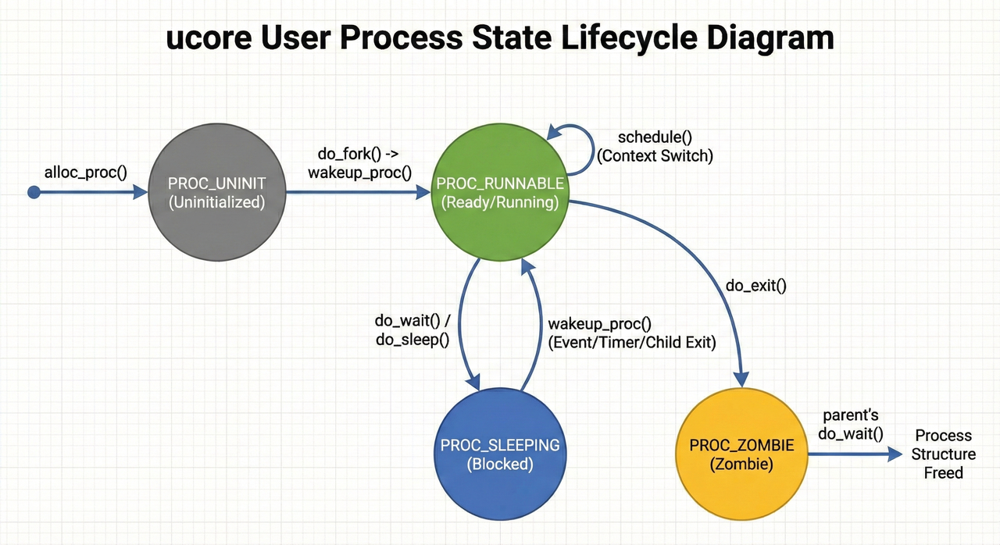
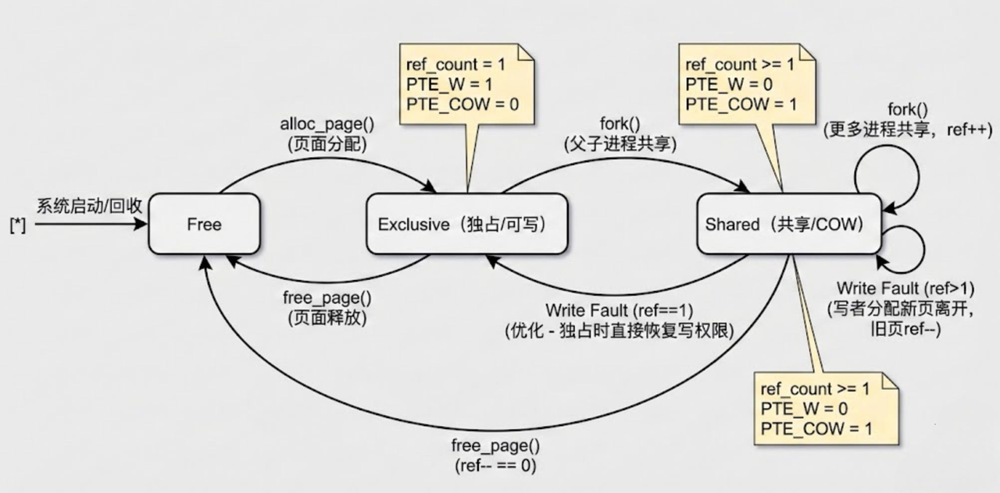

张奥喆（2313447） 余俊辉（2313486） 杨李泽（2313851）

***

# 练习1: 加载应用程序并执行（需要编码）

## 1. 设计实现过程

`load_icode` 函数的主要功能是加载 ELF 格式的二进制程序，并建立相应的用户进程内存空间。在函数的第 6 步，我们需要设置进程的中断帧（Trapframe），以确保当内核完成进程切换并返回用户态时，CPU 能够正确地跳转到应用程序的入口点，并拥有正确的栈指针和特权级。

具体的代码实现如下（位于 `kern/process/proc.c` 的 `load_icode` 函数中）：

```c
    // 设置用户栈指针
    // USTACKTOP 是用户栈的顶部地址，定义在 memlayout.h 中
    tf->gpr.sp = USTACKTOP;
    
    // 设置程序入口地址
    // elf->e_entry 存储了 ELF 文件的入口地址
    tf->epc = elf->e_entry;
    
    // 设置处理器状态
    // SSTATUS_SPP (Supervisor Previous Privilege): 设置为 0，表示之前的特权级是用户态（User Mode）
    // SSTATUS_SPIE (Supervisor Previous Interrupt Enable): 设置为 1，表示在从内核态返回后开启中断
    tf->status = (sstatus & ~SSTATUS_SPP) | SSTATUS_SPIE;
```

**实现逻辑说明：**

1. **`tf->gpr.sp = USTACKTOP;`**:  用户程序在执行时需要栈空间。我们在之前的步骤中已经建立了用户栈的内存映射，这里需要将栈指针（Stack Pointer, sp）初始化为用户栈的栈顶地址 `USTACKTOP`。

2. **`tf->epc = elf->e_entry;`**: `epc` (Exception Program Counter) 寄存器存储了发生异常或中断时的指令地址。当执行 `sret` 指令从内核态返回时，CPU 会跳转到 `epc` 指向的地址继续执行。因此，将其设置为应用程序的入口地址，即可让进程开始执行用户代码。

3. **`tf->status = ...;`**:

   * 清除 `SSTATUS_SPP` 位：`sret` 指令会根据 `SPP` 位来恢复特权级。将其清零确保返回后 CPU 处于 User Mode (U-Mode)。

   * 设置 `SSTATUS_SPIE` 位：确保用户进程在执行时，中断是开启的，这样操作系统才能通过时钟中断等机制重新夺回控制权（抢占式调度）。

## 2. 用户态进程从 RUNNING 到执行第一条指令的过程

### 第一阶段：构建与加载

**核心任务**：在内核态读取 ELF 可执行文件，并为其构建执行环境（内存空间与中断帧）。

1. **发起加载请求**：

   * 内核线程 `initproc` 创建子线程执行 `user_main`。

   * `user_main` 通过宏 `KERNEL_EXECVE` 调用 `kernel_execve` 函数，准备加载用户程序（如 `exit`）。

2. **触发同步异常**：

   * `kernel_execve` 并不直接加载，而是通过内联汇编执行 `ebreak` 指令并设置 `a7=10`，触发断点异常，模拟一次系统调用。

   * CPU 跳转至 `kern/trap/trap.c` 的 `exception_handler`，识别为 `CAUSE_BREAKPOINT` 后调用内核的 `syscall` 分发器。

3. **加载 ELF 与伪造现场**：

   * 内核调用 `sys_exec` -> `do_execve` -> `load_icode`。

   * **`load_icode`** 是核心函数，它完成以下工作：

     * **内存映射**：解析 ELF 文件头，建立用户页表，将代码段、数据段映射到用户虚拟地址空间，并分配用户栈。

     * **伪造中断帧 (Trapframe)**：精心构造当前进程的 `trapframe`。将 `tf->epc` 设置为 ELF 入口地址（用户程序第一条指令），将 `tf->gpr.sp` 设置为用户栈顶 `USTACKTOP`，并将 `tf->status` 中的 `SPP` 位清零（表示前一个特权级为 User Mode）。

### 第二阶段：首次执行

**核心任务**：利用中断返回机制，欺骗 CPU 从内核态“返回”到用户态，开始执行用户代码。

1. **异常返回**：

   * `load_icode` 返回后，中断处理流程结束，跳转至 `kern/trap/trapentry.S` 中的 `__trapret`。

2. **恢复上下文**：

   * 执行 `RESTORE_ALL` 宏，从刚才伪造的 `trapframe` 中恢复通用寄存器。此时 `sp` 寄存器被恢复为用户栈指针。

3. **特权级切换 (`sret`)**：

   * 执行 `sret` 指令。CPU 检查 `sstatus` 寄存器的 `SPP` 位（已被置为 0），因此将当前特权级从 **S Mode (内核态)** 切换至 **U Mode (用户态)**。

   * PC 跳转至 `sepc` 寄存器指向的地址（即用户程序入口），用户进程正式开始运行。

至此，用户进程开始在用户态执行代码。

### 第三阶段：调度与切换 (Scheduler -> Running)

假设这个进程之前被暂停了（处于 `PROC_RUNNABLE`），现在轮到它了：

1. **调度决策**：

   * 时钟中断或其他事件触发 `schedule()`。

   * `schedule()` 遍历进程链表，找到了这个标记为 `PROC_RUNNABLE` 的进程。

2. **上下文切换 (`switch_to`)**：

   * `proc_run()` 把它设为 `current`。

   * `switch_to` 恢复内核上下文。

3. **中断返回 (`forkret` -> `sret`)**：

   * **如果是新创建的进程**，它的内核上下文中的 `ra`（返回地址）是在 `copy_thread` 中被特意设置为 **`forkret`** 的。

   * 所以 `switch_to` 返回时，实际上是跳到了 `forkret`。

   * `forkret` 调用 `forkrets`，跳转到 `__trapret`。

   * `__trapret` 执行 `RESTORE_ALL`，把第一阶段 `load_icode` 伪造好的 `trapframe` 内容填入 CPU 寄存器。

   * **`sret`**：CPU 读取 `sstatus`（SPP=0），**切换到用户态**，跳转到 `sepc`（即 ELF 入口）。

***

# 练习2: 父进程复制自己的内存空间给子进程（需要编码）

在 `do_fork` 创建子进程时，内核需要将父进程的内存空间复制给子进程。`copy_range` 函数的主要负责完成这一过程。

## 1. `copy_range` 函数的设计与实现说明

### 1.1 实现逻辑

函数的执行流程如下：

1. **遍历内存地址**：根据传入的起始地址 `start` 和结束地址 `end`，以页大小 (`PGSIZE`) 为步长进行循环遍历。

2. **检查父进程页表**：对每一个虚拟地址，调用 `get_pte` 查找父进程（`from`）的页表项。如果不存或者无效，则跳过。

3. **分配子进程内存**：如果父进程该页有效，调用 `alloc_page()` 为子进程分配一个新的物理页 `npage`。

4. **复制数据**：

   * 使用 `page2kva(page)` 获取父进程物理页的内核虚拟地址（源地址）。

   * 使用 `page2kva(npage)` 获取子进程新物理页的内核虚拟地址（目的地址）。

   * 调用 `memcpy` 将源地址的 4KB 内容完全复制到目的地址。

5. **建立映射**：调用 `page_insert` 将新的物理页 `npage` 映射到子进程（`to`）的页表中，对应的线性地址为 `start`，权限 `perm` 与父进程保持一致。

### 1.2 代码实现

```c
int copy_range(pde_t *to, pde_t *from, uintptr_t start, uintptr_t end,
               bool share)
{
    assert(start % PGSIZE == 0 && end % PGSIZE == 0);
    assert(USER_ACCESS(start, end));
    // copy content by page unit.
    do
    {
        // call get_pte to find process A's pte according to the addr start
        pte_t *ptep = get_pte(from, start, 0), *nptep;
        if (ptep == NULL)
        {
            start = ROUNDDOWN(start + PTSIZE, PTSIZE);
            continue;
        }
        // call get_pte to find process B's pte according to the addr start. If
        // pte is NULL, just alloc a PT
        if (*ptep & PTE_V)
        {
            if ((nptep = get_pte(to, start, 1)) == NULL)
            {
                return -E_NO_MEM;
            }
            uint32_t perm = (*ptep & PTE_USER);
            // get page from ptep
            struct Page *page = pte2page(*ptep);
            // alloc a page for process B
            struct Page *npage = alloc_page();
            assert(page != NULL);
            assert(npage != NULL);
            int ret = 0;
            /* LAB5:EXERCISE2 YOUR CODE
             * replicate content of page to npage, build the map of phy addr of
             * nage with the linear addr start
             *
             * Some Useful MACROs and DEFINEs, you can use them in below
             * implementation.
             * MACROs or Functions:
             *    page2kva(struct Page *page): return the kernel vritual addr of
             * memory which page managed (SEE pmm.h)
             *    page_insert: build the map of phy addr of an Page with the
             * linear addr la
             *    memcpy: typical memory copy function
             *
             * (1) find src_kvaddr: the kernel virtual address of page
             * (2) find dst_kvaddr: the kernel virtual address of npage
             * (3) memory copy from src_kvaddr to dst_kvaddr, size is PGSIZE
             * (4) build the map of phy addr of  nage with the linear addr start
             */
            void *src_kvaddr = page2kva(page);
            void *dst_kvaddr = page2kva(npage);
            memcpy(dst_kvaddr, src_kvaddr, PGSIZE);
            ret = page_insert(to, npage, start, perm);

            assert(ret == 0);
        }
        start += PGSIZE;
    } while (start != 0 && start < end);
    return 0;
}
```

## 2. Copy on Write (COW) 机制的设计

Copy on Write (COW) 是一种推迟甚至避免内存拷贝的技术。它的核心思想是：在 `fork` 时不立即复制物理内存，而是让父子进程共享同一块物理内存，并将这些页面标记为只读。只有当任一进程尝试**写**这些页面时，才触发异常进行真正的物理内存拷贝。

以下是详细的设计方案：

### 2.1 copy\_range的修改

在创建子进程拷贝内存映射时，不再申请新页和拷贝内容。

* **逻辑变更**：

  1. 遍历父进程的 PTE。

  2. 如果 PTE 有效，获取对应的物理页 `page`。

  3. **取消写权限**：将父进程和子进程的 PTE 中的写权限位 (`PTE_W`) 全部置 0（标记为只读）。

  4. **共享映射**：使用 `page_insert` 将**同一个**物理页 `page` 映射到子进程的页表中。

  5. **增加引用计数**：因为父子进程都指向该物理页，必须增加该物理页的引用计数 (`page_ref_inc(page)`)。

  6. **TLB 刷新**：由于修改了父进程的页表权限，必须刷新 TLB 以确保硬件感知到权限变更。

### 2.2 Page Fault 处理流程 (`do_pgfault`) 的修改

当程序尝试写入上述被标记为“只读”的共享页时，CPU 会触发 Page Fault。需要在 `vmm.c` 中的 `do_pgfault` 函数中增加对 COW 的处理逻辑。

* **判定条件**：

  * 异常原因是“写入”。

  * PTE 显示该页不可写（`!PTE_W`）。

  * 但该虚拟地址所在的 VMA（虚拟内存区域）属性是可写的（`VM_WRITE`）。

  * 这说明这是一个 COW 页，而不是真正的非法写入。

* **处理流程**：

  1. **分配新页**：调用 `alloc_page` 申请一个新的物理页。

  2. **拷贝内容**：将旧的共享物理页的内容 `memcpy` 到新分配的物理页中。

  3. **更新当前进程页表**：

     * 修改当前进程（触发异常的进程）的 PTE，使其指向**新分配的物理页**。

     * **恢复写权限**：设置新页的 PTE 权限为 `PTE_W`（可写）。

  4. **减少旧页引用**：对旧的共享物理页执行 `page_ref_dec`。

     * *优化点*：如果 `page_ref` 降为 1，说明只剩下一个进程在使用该页，对于剩下的那个进程，可以直接恢复其写权限，而不需要再次拷贝（当然，这需要额外的逻辑去更新另一个进程的页表，或者等到另一个进程写时再处理）。

  5. **刷新 TLB**：确保新的映射生效。

### 2.3 极端情况与优化&#x20;

* **引用计数为 1 的优化**： 在进入 Page Fault 处理时，首先检查共享页的 `page_ref`。如果引用计数已经是 1（说明其他进程已经退出了或者已经发生了 COW 分离），则不需要分配新页。

  * 操作：直接将当前 PTE 的 `PTE_W` 标记位置为 1，刷新 TLB 即可。这能节省一次 `alloc_page` 和 `memcpy` 的开销。

* **并发安全**： 在多核环境下，对 `page_ref` 的操作必须是原子的，但在 uCore 实验环境中通常使用自旋锁或禁用中断来保护临界区。

### 2.4 概要设计图示

```plain&#x20;text
[阶段 1: Fork 之后]
Process A (Parent) VPN 0x100  ---> [ Physical Page Frame 0x5000 ] <--- Process B (Child) VPN 0x100
PTE A: Read-Only                   (Ref Count = 2)                 PTE B: Read-Only

[阶段 2: Process B 尝试写入 0x100]
1. CPU 触发 Store Page Fault。
2. Kernel 捕获异常，检测到是 COW 情况。
3. Kernel 分配新物理页 0x6000。
4. Kernel 将 0x5000 的内容拷贝到 0x6000。

[阶段 3: 处理完成]
Process A (Parent) VPN 0x100  ---> [ Physical Page Frame 0x5000 ]
PTE A: Read-Only (或延后更新)       (Ref Count = 1)

Process B (Child)  VPN 0x100  ---> [ Physical Page Frame 0x6000 ]
PTE B: Read/Write                  (Ref Count = 1)
```

***

# 练习3: 阅读分析源代码，理解进程执行 fork/exec/wait/exit 的实现，以及系统调用的实现（不需要编码）

## 1. 执行流程分析

这些函数构成了进程管理的生命周期，它们涉及用户态和内核态的频繁交互。

#### **fork (创建进程)**

* **用户态**: 用户程序调用 `fork()` 库函数。该函数执行 `ecall` 指令，触发系统调用中断，传入系统调用号 `SYS_fork`。

* **内核态**:

  1. 中断处理入口 `trap()` -> `syscall()` -> `sys_fork()` -> `do_fork()`。

  2. **`do_fork`**:

     * 分配新的 `proc_struct`。

     * 分配内核栈。

     * **`copy_mm`**: 复制父进程的内存空间（如果是 `COW` 机制，则只复制页表并标记只读）。

     * **`copy_thread`**: 复制父进程的 `trapframe` 到子进程。**关键点**：设置子进程 `trapframe` 中的 `a0` 寄存器为 0（这是子进程 `fork` 返回值为 0 的原因）。设置子进程 `context.ra` 为 `forkret`，`context.sp` 指向 `trapframe`。

     * 将子进程加入进程链表，状态设为 `PROC_RUNNABLE`。

  3. 函数返回子进程的 PID 给父进程（通过父进程 `trapframe` 的 `a0` 寄存器）。

* **返回**: 父进程从内核态返回，`fork()` 返回子进程 PID。子进程被调度执行时，从内核态返回，`fork()` 返回 0。

#### **exec (执行新程序)**

* **用户态**: 调用 `exec()`。触发 `ecall`。

* **内核态**: `sys_exec()` -> `do_execve()`。

  1. **`do_execve`**:

     * 检查用户内存合法性。

     * **`exit_mmap`**: 回收当前进程的内存空间（页表、VMA）。

     * **`load_icode`**: 解析 ELF 文件，建立新的内存映射（代码段、数据段、BSS、用户栈）。

     * **重置 Trapframe**: 如练习1所述，设置 `sp` 为新栈顶，`epc` 为新程序入口。

* **返回**: `exec` 成功后不返回原来的代码逻辑，而是通过 `sret` 跳转到新程序的入口地址开始执行。

#### **wait (等待子进程)**

* **用户态**: 调用 `wait()`。触发 `ecall`。

* **内核态**: `sys_wait()` -> `do_wait()`。

  1. **`do_wait`**:

     * 查找是否有子进程。

     * 如果有子进程处于 `PROC_ZOMBIE` 状态：回收该子进程剩余的资源（内核栈、`proc_struct`），并获取其退出码。

     * 如果子进程还在运行：当前进程状态设为 `PROC_SLEEPING`，`wait_state` 设为 `WT_CHILD`，并调用 `schedule()` 让出 CPU。

* **交互**: 当子进程退出时会唤醒父进程，父进程从 `schedule()` 返回，再次尝试回收资源。

* **返回**: 返回退出的子进程 PID 和退出状态。

#### **exit (进程退出)**

* **用户态**: 调用 `exit()`。触发 `ecall`。

* **内核态**: `sys_exit()` -> `do_exit()`。

  1. **`do_exit`**:

     * `mm_destroy`: 释放进程的虚拟内存空间（物理页引用计数减一）。

     * 状态设为 `PROC_ZOMBIE`。

     * 设置退出码 `exit_code`。

     * 如果有父进程正在等待（`WT_CHILD`），唤醒父进程。

     * 如果自己有子进程，将子进程过继给 `initproc`。

     * 调用 `schedule()` 切换到其他进程。

* **返回**: `exit` 不会返回给用户程序，因为进程已经结束执行。

**问题回答总结：**

* **交错执行**: 用户程序通过 `ecall` 进入内核，内核处理完后通过 `sret` 返回用户。或者内核在处理过程中发生调度（`schedule`），挂起当前进程，切换到另一进程。

* **内核结果返回**: 内核将结果写入当前进程 `trapframe` 的 `a0` 寄存器。当 `trap` 返回时，`RESTORE_ALL` 会将 `trapframe` 中的值恢复到 CPU 的 `a0` 寄存器，用户态程序读取该寄存器作为函数返回值。

## 2. 用户态进程执行状态生命周期图



***

# 扩展练习 Challenge

## 实现 Copy on Write （COW）机制

### 1. 设计思路与实现原理

Copy-on-Write (COW) 是一种内存管理优化技术。其核心思想是：当父进程创建子进程时，不立即复制父进程的物理内存页面给子进程，而是让父子进程共享同一块物理内存。只有当其中一个进程尝试修改这些共享页面时，内核才分配新的物理页面，并将原页面的内容拷贝过去，从而实现“私有化”。

#### 关键修改点：

1. **页表项标志位 (`PTE_COW`)**:
   在 mmu.h 中定义了一个未使用的位作为 `PTE_COW` 标志，用于标识该页面是共享的且处于写时复制状态。

```c
#define PTE_COW 0x100 // 使用第8位（RSW）作为COW标志
```

* **进程创建 (`fork` -> `dup_mmap`)**:
  修改 vmm.c 中的 `dup_mmap` 函数。在调用 copy\_range 时，将 share 参数置为 `1`。这告诉内核在复制内存映射时，不要进行物理内存的深拷贝，而是建立共享映射。

* **内存映射复制 (**&#x63;opy\_rang&#x65;**)**:
  修改 pmm.c 中的 copy\_range 函数。当 share=1 时：

  * 获取父进程的物理页 page。

  * 将父进程和子进程的页表项（PTE）都设置为**只读** (`PTE_W` 置 0)。

  * 将父进程和子进程的页表项都设置 `PTE_COW` 标志。

  * 使用 page\_insert 建立映射，这会自动增加物理页的引用计数。

* **缺页异常处理 (`do_pgfault`)**:
  修改 vmm.c 中的 `do_pgfault` 函数，增加对 COW 的处理逻辑：

  * 当发生写异常（`error_code` 指示写操作）且 PTE 中包含 `PTE_COW` 标志时，判定为 COW 事件。

  * **分配新页**：申请一个新的物理页。

  * **拷贝内容**：将旧物理页的内容 `memcpy` 到新物理页。

  * **建立新映射**：将当前虚拟地址映射到新物理页，并设置属性为**可写** (`PTE_W`)，同时清除 `PTE_COW` 标志。

  * **引用计数处理**：page\_insert 会自动处理旧页面的引用计数减少。如果旧页面引用计数降为 1（即只剩下一个进程持有），理论上该进程也可以恢复写权限（优化点）。

### 2.2 状态转换说&#x660E;**（有限状态自动机）**

我们可以将物理页面的生命周期看作一个有限状态机。下图展示了物理页在 COW 机制下的状态转换。



**状态定义：**

* **Exclusive (E)**: 独占状态。页面只被一个进程引用，PTE 具有写权限 (`PTE_W`)，无 COW 标志。这是页面刚被 alloc\_page 分配时的状态。

* **Shared (S)**: 共享状态。页面被多个进程（父子进程）引用，PTE 为只读 (`~PTE_W`)，且设置了 `PTE_COW` 标志。

**事件与转换：**

1. **Fork (E -> S)**:

   * **事件**：父进程调用 `fork()`。

   * **动作**：内核遍历页表，将父进程的 PTE 设为只读并标记 COW；子进程共享该物理页，PTE 也设为只读并标记 COW。物理页引用计数 `ref > 1`。

   * **结果**：页面进入 Shared 状态。

2. **Write Fault (S -> E) \[Copy Case]**:

   * **事件**：进程尝试写入处于 Shared 状态的页面。

   * **条件**：物理页引用计数 `ref > 1`。

   * **动作**：触发 Page Fault。内核分配新物理页（New Page 初始为 E 状态），拷贝内容。当前进程的 PTE 指向新页，恢复写权限。原物理页引用计数减 1。

   * **结果**：当前进程持有的新页面处于 Exclusive 状态。原页面仍处于 Shared 状态（如果还有其他共享者）或转变为 Exclusive 状态（如果只剩一个持有者）。

3. **Write Fault (S -> E) \[Reuse Case] (优化)**:

   * **事件**：进程尝试写入处于 Shared 状态的页面。

   * **条件**：物理页引用计数 `ref == 1`（例如其他共享进程已退出）。

   * **动作**：触发 Page Fault。内核检测到只有当前进程持有该页，无需拷贝。直接修改 PTE，恢复写权限，清除 COW 标志。

   * **结果**：页面恢复为 Exclusive 状态。

### 2.3 Dirty COW 分析与模拟

**原理：**&#x44;irty COW 是 Linux 内核中的一个竞态条件漏洞。它利用了 COW 机制中的缺陷。攻击者通过两个线程并发执行：

* **线程 A**: 写入一个只读映射的内存区域，触发缺页中断，内核开始处理 COW。

* **线程 B**: 在线程 A 处理缺页中断的过程中，调用 `madvise(MADV_DONTNEED)` 通知内核丢弃该页面的映射。

**竞态后果**：如果时序恰当，线程 B 清空了页表项。当线程 A 的 COW 逻辑执行到“写入页表项”这一步时，或者在重试过程中，由于页表项为空，内核可能会错误地重新获取原始的只读页面，并对其进行写入。这导致了对只读文件的非法修改。

**在 ucore 中模拟的困难与解决方案：**

* **模拟困难**：

  1. **多线程支持**：ucore 目前的用户进程主要是单线程的。要模拟 Dirty COW，需要在一个进程内有两个并发执行流（线程）共享同一地址空间，一个写内存，一个操作页表。

  2. **系统调用缺失**：ucore 没有实现 `madvise` 或类似的系统调用来允许用户态主动丢弃页面映射。

  3. **文件映射**：Dirty COW 的巨大危害在于修改磁盘上的只读文件。ucore Lab 5 主要关注匿名内存的 COW，虽然原理相同，但攻击场景不同。

* **解决方案**：
  在 ucore 中防止此类并发错误的根本方法是**加锁**。
  在 `do_pgfault` 处理 COW 的过程中，必须持有页表锁（`mm->page_table_lock` 或类似的锁）。

  1. 进入 `do_pgfault`。

  2. 获取锁。

  3. 检查 PTE 状态（确认还是 COW 且未被修改）。

  4. 分配新页、拷贝。

  5. 修改 PTE。

  6. 释放锁。

* 如果 ucore 支持多线程，必须确保在步骤 2-6 期间，其他线程不能通过 `madvise` 或其他方式修改该 PTE。Linux 社区的修复方案引入了一个新的标志 `FOLL_COW`，确保在获取页面引用时就强制完成 COW 过程，而不是依赖后续的缺页中断。

***

## 说明该用户程序是何时被预先加载到内存中的？与我们常用操作系统的加载有何区别，原因是什么？

### 1. 用户程序何时被预先加载？

在本次实验的环境中，用户程序（如 `hello`, `exit`, `cowtest` 等）是在内核启动时就已经存在于物理内存中了。

具体流程如下：

1. **编译链接阶段**：Makefile 会将用户程序的源代码编译成二进制文件（`.out` 或 `.o`）。

2. **链接入内核**：链接器（`ld`）将这些用户程序的二进制数据直接链接到内核的可执行文件（`kernel`）的数据段中。在 proc.c 中，通过宏 `KERNEL_EXECVE` 使用了类似 `_binary_obj___user_hello_out_start` 的符号。这些符号直接指向内核内存空间中存储用户程序二进制代码的位置。

3. **Bootloader 加载**：当计算机启动，Bootloader 将整个内核镜像（包含嵌入的用户程序数据）加载到物理内存中。

4. **进程创建阶段**：当内核调用 `kernel_execve` -> `user_main` -> `kernel_execve` (宏) -> `do_execve` 时，内核调用 `load_icode`。

5. **内存拷贝**：`load_icode` 函数解析内存中的 ELF 格式数据（即之前嵌入的那块数据），并将其中的代码段、数据段**拷贝**到新创建的用户进程的虚拟内存空间中。

所以，**“预先加载”发生在内核启动时**，用户代码作为内核镜像的一部分被载入内存。而“真正加载到进程空间”发生在 `exec` 系统调用时。

### 2.2 与常用操作系统（如 Linux/Windows）的区别及原因

#### 区别：

#### 原因：

1. **文件系统的缺失/简化**：
   在 Lab 5 阶段，ucore 的文件系统可能尚未完全集成或为了简化实验难度而被旁路。如果依赖文件系统，需要实现磁盘驱动、文件系统驱动、缓冲区管理等复杂模块。将用户程序直接嵌入内核镜像可以避开这些依赖，专注于进程管理和虚拟内存管理的实验目标。

2. **教学目的与简化**：
   操作系统的教学实验通常采用循序渐进的方式。在没有完善文件系统之前，为了测试进程调度和内存管理，必须有一种方式运行用户代码。嵌入式加载是最简单直接的方法，它保证了测试程序在任何环境下（只要内核能启动）都可用。

3. **环境限制**：
   在 QEMU 这样的模拟环境中，制作和挂载磁盘镜像比直接加载一个大的内核 ELF 文件要复杂。嵌入方式使得 `make qemu` 流程非常简单。

***

# 分支任务：gdb 调试页表查询过程

## 1. 调试流程与关键调用路径分析

### 1.1 关键调用路径与分支逻辑

通过在 QEMU 源码中打断点并单步追踪，我梳理出了 RISC-V 架构处理访存请求的核心调用栈及决定的关键分支：

1. **入口：`riscv_cpu_tlb_fill`** (位于 `target/riscv/cpu_helper.c`)

   * **功能**：处理 TLB Miss 的总入口。

   * **关键分支**：

   ```c
    if (mode == PRV_M && access_type != MMU_INST_FETCH) { ... }
   ```

   * 函数首先检查当前的特权级模式（`mmu_idx`）。如果处于 M Mode（物理模式），则直接进行物理地址映射；如果处于 S Mode 或 U Mode，则进入页表翻译流程。

2. **核心翻译：`get_physical_address`** (位于 `target/riscv/cpu_helper.c`)

   * **功能**：模拟硬件 Page Table Walk（页表遍历）。

   * **关键分支 1（开启分页检查）**：

   ```c
    if (mode == PRV_M || !riscv_feature(env, RISCV_FEATURE_MMU)) { ... }
   ```

   * 判断是否开启了 MMU。若未开启（Bare Mode），直接返回物理地址；否则继续执行分页逻辑。

   * **关键分支 2（页表遍历循环与叶子节点判断）**： 代码进入 `for` 循环遍历页表级数。在循环内部，最核心的判断语句是：

   ```c
    if (!(pte & (PTE_R | PTE_W | PTE_X))) { ... }
   ```

   * **If 成立**：表示 R/W/X 位全为 0，该 PTE 是指向下一级页表的指针（Pointer），循环继续。

   * **Else (If 不成立)**：表示 R/W/X 中有置位，该 PTE 是**叶子节点（Leaf Page）**，即翻译结束，找到了物理页。

3. **结果回填：`tlb_set_page`** (位于 `accel/tcg/cputlb.c`)

   * **功能**：在翻译成功（`TRANSLATE_SUCCESS`）后，将结果填入 QEMU 的软件 TLB。

### 1.2 虚拟地址翻译演示（结合具体数据）

**场景**：ucore 内核进入 S Mode 后的取指操作。

* **虚拟地址 (VA)**：`0xffffffffc02000d8`

* **物理地址 (PA)**：`0x802000d8`

**QEMU 模拟流程与分支执行演示**：

1. **模式检查**： 进入 `riscv_cpu_tlb_fill`。GDB 显示 `mmu_idx = 1` (S Mode)。

   * **分支走向**：`mode == PRV_M` 判断为假，代码绕过直通逻辑，调用 `get_physical_address`。

2. **提取基址**： 从 `env->satp` 寄存器中提取 PPN，计算出根页表物理地址 `base = 0x1b880205000`。

3. **硬件查表 (Page Walk)**： 代码进入 `get_physical_address` 的主循环。

   * **读取 PTE**：通过 `ldq_phys` 读取到的 PTE 值为 `0x200000cf`。

   * **关键分支验证（巨页识别）**： 程序执行到关键判断语句：

   ```c
    // 检查 R, W, X 位
    if (!(pte & (PTE_R | PTE_W | PTE_X))) 
   ```

   * **数据分析**：PTE `0x200000cf` 的低 8 位为 `1100 1111`，其中 R=1, W=1, X=1。

   * **判定结果**：`pte & (PTE_R | PTE_W | PTE_X)` 的结果非零，因此 `!` 运算后条件为 **False**。

   * **执行流**：代码**跳过**了“继续查找下一级页表”的 `if` 块，直接进入 `else` 分支。

   * **结论**：模拟器判定当前节点为**叶子节点**。由于这是在第一轮循环（Level 2）就发生了，这证明该地址属于一个 **1GB 的巨页（Gigapage）**，无须继续查后续两级页表。

4. **物理地址计算**： 提取 PTE 中的 PPN `0x80000`，结合偏移量计算最终物理地址 `0x802000d8`，翻译结束。

## 2. 单步调试页表翻译与关键操作流程

在 GDB 中断点捕获到内核虚拟地址 `0xffffffffc02000d8` 后，我使用 `n` (next) 命令在 `get_physical_address` 函数中单步执行，重点观察了 QEMU 如何通过一个 `for` 循环模拟硬件的页表遍历（Page Table Walk）过程。

### 2.1 第一步：计算索引与页表项地址

程序进入循环的第一轮（`i=0`，对应 Sv39 的 Level 2 页表）。GDB 停在如下代码行：

```c
 // target/riscv/cpu_helper.c
  // 模拟硬件电路：通过位移操作从虚拟地址中提取 VPN (Virtual Page Number)
 target_ulong idx = (addr >> (PGSHIFT + ptshift)) & ((1 << ptidxbits) - 1);
  // 结合基地址 (base) 和索引 (idx) 计算页表项 (PTE) 的物理地址
 target_ulong pte_addr = base + idx * ptesize;
```

**解释**：这里 QEMU 通过软件位运算模拟了 MMU 硬件电路的行为。它将虚拟地址右移并掩码，提取出当前级页表的索引值 `idx`，然后结合根页表基址（来自 `satp`）计算出 PTE 在物理内存中的位置。

### 2.2 第二步：模拟物理内存读取 (关键数据获取)

继续单步执行，GDB 停在读取内存的函数上：

```c
// 模拟 CPU 向总线发出读请求，获取页表项内容
 target_ulong pte = ldq_phys(cs->as, pte_addr);
```

此时，我使用 GDB 命令查看读取到的变量值，这是分析的关键转折点：

```c
 (gdb) p /x pte
  $8 = 0x200000cf
```

**调试分析**：读取到的 PTE 值为 `0x200000cf`。

* **低 8 位 (Flags)**：`0xcf` 即二进制 `1100 1111`。

* **含义**：**V** (Valid)=1, **R** (Read)=1, **W** (Write)=1, **X** (Execute)=1。

### 2.3 第三步：关键分支判断 (巨页的发现)

紧接着，代码执行到了决定页表遍历是否继续的关键分支语句：

```c
 // 检查 PTE 的 R, W, X 位
 // 逻辑：如果 R/W/X 全为 0，则是指向下一级的目录指针；否则是叶子节点
 if (!(pte & (PTE_R | PTE_W | PTE_X))) {
     // [分支 A]：继续下一级循环
     ptshift -= ptidxbits;
 } else {
     // [分支 B]：找到物理页，退出循环
 }
```

**调试观察**： 在 GDB 中，我观察到程序**并没有进入 `if` 代码块**，而是直接跳到了 `else` 分支（或者跳过了 if 块继续向下执行权限检查）。

**原理解释**： 由于我们刚才读到的 PTE (`0x200000cf`) 中，R、W、X 位均为 1，使得 `(pte & (PTE_R | PTE_W | PTE_X))` 结果非零，因此 `if` 条件判断为**假 (False)**。

**结论**： 这一调试现象直接证明了 **QEMU 判定当前 PTE 为“叶子节点”**。 由于这发生在循环的**第一轮 (Level 2)**，意味着 QEMU 在查找第一级页表时就找到了物理页，而没有继续查 Level 1 和 Level 0。这证实了 ucore 在内核地址空间（`0xffffffffc0...`）使用了 **1GB 巨页 (Gigapage)** 映射策略，直接将虚拟地址的高位映射到了物理地址 `0x80000000` 开始的大块连续内存上。

## 3. TLB 查找代码与逻辑差异分析

### 3.1 QEMU 中模拟 TLB 查找与填充的 C 代码机制

虽然 QEMU 为了模拟速度，将大部分 TLB 查找逻辑（TLB Lookup）直接编译为宿主机汇编指令（即 TCG Fast Path），导致我们难以直接在 C 源码层面单步调试“TLB 命中”的过程。但是，通过调试我们捕捉到了 **TLB 查找失败（TLB Miss）** 后的处理逻辑，这是 QEMU 模拟 MMU 行为的核心 C 代码所在。

* **查找入口与未命中机制** 在 QEMU 的设计中，当 TCG 生成的汇编代码在软 TLB（Soft TLB）中查找虚拟地址失败时，会触发“慢速路径”异常，进而调用架构相关的 C 函数来处理未命中情况。

- **调试证据**：我们的断点 `riscv_cpu_tlb_fill` (位于 `target/riscv/cpu_helper.c`) 被触发。

- **逻辑解释**：这个函数的被调用本身就意味着**前置的 TLB 查找动作已经执行并失败了**。它是硬件 CPU 在检测到 TLB Miss 后启动硬件页表遍历器（Page Table Walker）的软件模拟对应物。

* **模拟 TLB 的更新 (Fill)** 在 `riscv_cpu_tlb_fill` 完成页表遍历并获得物理地址后，必须将结果“回填”到模拟的 TLB 结构中，以便下次访问能命中快速路径。

- **关键代码**：

```c
 // target/riscv/cpu_helper.c
 tlb_set_page(cs, address & TARGET_PAGE_MASK, pa & TARGET_PAGE_MASK, ...);
```

* **调试细节**： 通过 GDB 单步执行到此行，我们观察到 QEMU 将计算出的 `<虚拟页号, 物理页号>` 映射关系写入了 `CPUState` 结构体下的 `tlb_table` 中。这对应了真实 CPU 更新内部 TLB 缓存行的操作。

**结论**： 我们在 QEMU 源码中找到并调试的不仅仅是“填充”代码，而是**完整的 TLB Miss 处理子系统**。它模拟了真实 CPU 在“查找 TLB 失败 -> 暂停流水线 -> 查询页表 -> 更新 TLB -> 重试指令”这一复杂硬件过程中的关键 C 语言实现部分。

### 3.2 QEMU 模拟 TLB 与真实硬件 TLB 的逻辑区别

在调试中，我对比了未开启 MMU（Bare Mode）和开启 MMU 后的行为，发现了一个重要的逻辑差异：

1. **Bare Mode (未开启虚拟内存)**：

   * **调试现象**：访问 `0x80000000` 时，`riscv_cpu_tlb_fill` 被调用，但在 `get_physical_address` 中直接判断 `mode == PRV_M`，立即返回物理地址，不涉及页表。这模拟了硬件的直通路径。

2. **Paging Mode (开启虚拟内存) - 粒度差异**：

   * **真实硬件 TLB**：对于上文发现的 1GB 巨页，真实 CPU 的 TLB 应该会缓存一个 **1GB 大小的条目**。后续访问该 1GB 范围内的任何地址都应命中 TLB。

   * **QEMU 模拟 TLB**：

     * **调试现象**：我先捕捉到了 `...c02000d8` 的访问，TLB 填充。仅仅几条指令后，又捕捉到了 `...c0203f78` 的访问（位于同一个 1GB 巨页内，但跨越了 4KB 边界）。

     * **分析**：在 `tlb_set_page` 函数中，参数使用了 `TARGET_PAGE_MASK`（通常是 4KB）。

     * **结论**：**QEMU 的软件 TLB 主要是以 4KB 为粒度管理的。** 即使页表映射是 1GB 巨页，QEMU 为了实现简单，依然将其拆分为多个 4KB 的 TLB 表项进行缓存。这就是为什么在同一个巨页内，QEMU 依然会多次触发 `tlb_fill`。

## 4. 调试过程中的有趣细节

1. **SIGPIPE 的中断**：

   * **细节**：刚开始 attach 到 QEMU 进程时，GDB 不断被 `SIGPIPE` 信号打断，导致无法正常调试。以为是环境装挂了，非常抓马。

   * **解决**：这是 QEMU 内部通信机制产生的正常信号。通过在 GDB 中执行 `handle SIGPIPE nostop noprint` 忽略该信号后解决。

2. **代码模拟数字电路**：

   * **细节**：看着 `get_physical_address` 函数里用 `>>` 和 `&` 这种位运算模拟硬件电路的连线逻辑（提取 VPN、拼接 PPN），切实体会到了“模拟器就是用软件逻辑来通过图灵完备性模拟硬件逻辑”的本质。

3. **巨页**：

   * **细节**：本以为会看到完整的 3 级页表循环（i=0, 1, 2），结果循环跑了一次就退出了。通过解码 PTE 发现是 RWX 全为 1，才意识到内核用了 1GB 巨页。

## 5. 大模型辅助调试记录

### 5.1 场景一：非源码安装环境下的调试版构建

在实验准备阶段，我发现本地机器上的 QEMU 是通过 `sudo apt install` 直接安装的二进制版本，缺失源码和调试符号，无法进行源码级调试。我担心重新安装会破坏现有环境，因此向大模型寻求解决方案。

**我的提问：**

> “我之前的 qemu 不是通过源码进行安装的，而是直接 sudo 安装的，我现在应该怎么做？”

**大模型的解决思路与交互：** 大模型给出了一个既安全又高效的“双版本共存”方案，避免了覆盖系统原有环境的风险：

1. **保留官方版**：不动系统路径下的 `/usr/bin/qemu-*`。

2. **独立编译调试版**：指导我下载 QEMU 4.1.1 源码，并指出核心配置参数 `./configure --target-list=riscv64-softmmu --enable-debug`。特别强调了 **`--enable-debug`** 是生成调试符号的关键。

3. **关键提示**：特别提醒编译完成后**不要执行** `sudo make install`，而是直接修改 ucore 的 Makefile，将 `QEMU` 变量指向新编译的二进制文件绝对路径。

### 5.2 场景二：在庞大的源码中定位核心函数

QEMU 源码量巨大，要在 RISC-V 架构下找到负责 MMU 地址翻译的具体 C 代码如同大海捞针。我不确定该在哪个文件、哪个函数打断点。

**我的提问：**

> “在 QEMU 4.1.1 的 RISC-V 实现中，负责将虚拟地址转换为物理地址的核心函数通常叫什么？在哪个文件里？”

**大模型的解决思路与交互：** 大模型迅速帮我缩小了搜索范围，直接指出了核心文件 `target/riscv/cpu_helper.c`，并理清了两个关键函数的“父子关系”：

1. **入口函数 `riscv_cpu_tlb_fill`**：处理 TLB Miss 的总入口。大模型建议以此为断点，因为它是非静态全局函数，GDB 容易捕捉。

2. **核心逻辑 `get_physical_address`**：真正的页表遍历（Page Table Walk）逻辑所在，负责读取 SATP 并逐级查表。

### 5.3 场景三：解析“巨页”与 QEMU TLB 粒度的差异

在调试中我发现了一个矛盾现象：根据页表项（PTE）分析，内核使用了 1GB 巨页（Gigapage），按理说查一次页表后，整个 1GB 范围内的访问都应命中 TLB。然而，GDB 显示在访问同一个 1GB 区域内相邻的地址（仅相差几 KB）时，QEMU 再次触发了 `tlb_fill` 断点。

**我的提问：**

> “为什么依然断下来了？（提供了第二次中断的 GDB 上下文，显示操作为 `MMU_DATA_STORE`，地址偏移量很小）”

**大模型的解决思路与交互：** 大模型敏锐地指出了**硬件定义与软件模拟实现的差异**，这是本次实验的一个高价值知识点：

1. **现象分析**：指出第二次访问是 `Store` 操作，且地址与第一次位于同一个 1GB 区域。

2. **源码实证**：引导我观察代码行 `tlb_set_page(cs, address & TARGET_PAGE_MASK, ...)`。

3. **核心结论**：虽然 RISC-V 硬件页表支持 1GB 巨页，但 QEMU 的软件 TLB 实现（Soft TLB）为了通用性和简化逻辑，是按 **4KB (`TARGET_PAGE_MASK`)** 粒度进行管理的。

***

# 分支任务：gdb 调试系统调用以及返回

## 1. 调试流程与关键指令处理分析

### 1.1 捕获 `ecall`：从用户态陷入内核态

用户程序执行 `exit()` 系统调用，最终调用 `ecall` 指令请求内核服务。

**调试操作与观察**：

1. **ucore 侧定位**：在终端 3 中，我加载了用户程序符号表，并单步执行汇编指令，直到 `ecall` 指令处。

```c
 (gdb) add-symbol-file obj/__user_exit.out
 add symbol table from file "obj/__user_exit.out"
 (y or n) y                            
 Reading symbols from obj/__user_exit.out...
 (gdb) si
 0x0000000000800104      19          asm volatile (
 1: x/i $pc
 => 0x800104 <syscall+44>:    ecall
```

* **QEMU 侧捕获**：在终端 2，我对异常处理入口函数 `riscv_cpu_do_interrupt` 设置断点。当 ucore 执行 `ecall` 时，断点成功触发：

```c
Thread 3 "qemu-system-ris" hit Breakpoint 1, riscv_cpu_do_interrupt (cs=0x5cb4142b0890) at /usr/OS-lab/qemu-4.1.1/target/riscv/cpu_helper.c:507
 507         RISCVCPU *cpu = RISCV_CPU(cs);
```

**源码与动态分析**： `riscv_cpu_do_interrupt` (位于 `target/riscv/cpu_helper.c`) 是 QEMU 处理所有硬件中断和异常的枢纽。我通过单步执行 (`n`) 配合变量查看，分析了状态机迁移过程：

* **步骤一：识别异常原因** 代码通过检查 `cause` 变量来确定中断类型。我在 GDB 中打印了 `env->scause`，其值为 **8**，对应 `RISCV_EXCP_U_ECALL`。

```c
(gdb) n
 ...
 543             if (cause == RISCV_EXCP_U_ECALL) {
 (gdb) n
 544                 assert(env->priv <= 3);
```

* 这验证了 QEMU 正确识别了当前指令为用户态发起的系统调用。

* **步骤二：特权级切换与现场保存** 这是模拟硬件行为最关键的部分。代码进入 `if (env->priv <= PRV_S)` 分支，执行寄存器更新。

```c
 // target/riscv/cpu_helper.c 源码逻辑
 // 1. 保存当前特权级到 mstatus 的 SPP 字段
 s = set_field(s, MSTATUS_SPP, env->priv);
 
 // 2. 保存异常原因到 scause 寄存器
 env->scause = cause | ...;
 
 // 3. 保存返回地址 (即 ecall 指令地址) 到 sepc 寄存器
 env->sepc = env->pc;
 
 // 4. 修改 PC 指针，跳转到中断向量表基址 (stvec)
 env->pc = (env->stvec >> 2 << 2) + ...;
```

* **调试解释**：这段 C 代码完美模拟了 CPU 硬件电路在时钟沿到来时的动作——自动保存现场并强制跳转。至此，CPU 正式从 U-Mode 切换到了 S-Mode，准备执行内核代码。

### 1.2 捕获 `sret`：从内核态返回用户态

**调试场景**：内核完成 `sys_exit` 处理，执行到 `__trapret` 段的 `sret` 指令，准备交还控制权。

**调试操作与观察**：

1. **ucore 侧定位**：控制 ucore 运行至 `sret` 指令前。

2. **QEMU 侧捕获**：在终端 2 对 `helper_sret` 函数设置断点（这是 `sret` 指令的 TCG 辅助函数）。

```c
Thread 3 "qemu-system-ris" hit Breakpoint 2, helper_sret (env=0x5cb4142b92a0, cpu_pc_deb=18446744072637910830) at /usr/OS-lab/qemu-4.1.1/target/riscv/op_helper.c:76
 76          if (!(env->priv >= PRV_S)) {
```

**源码与动态分析**： `helper_sret` (位于 `target/riscv/op_helper.c`) 负责模拟特权级恢复。我在单步调试中重点观察了以下逻辑：

* **步骤一：读取返回目标与前一特权级**

```c
 (gdb) n
 80          target_ulong retpc = env->sepc;
 (gdb) n
 ...
 91          target_ulong prev_priv = get_field(mstatus, MSTATUS_SPP);
```

* **调试解释**：此时 `retpc` 从 `sepc` 寄存器恢复，指向用户程序中 `ecall` 的下一条指令；而 `prev_priv` 从 `mstatus.SPP` 读取，值为 **0 (U-Mode)**。这意味着 CPU 知道自己即将降级回用户态。

* **步骤二：执行模式切换**

```c
 (gdb) n
 97          mstatus = set_field(mstatus, MSTATUS_SPP, PRV_U);
 (gdb) n
 98          riscv_cpu_set_mode(env, prev_priv);
 (gdb) n
 101         return retpc;
```

* **调试解释**： 当单步执行过 `riscv_cpu_set_mode` 后，虽然在 C 语言层面这只是一次函数调用，但在模拟器层面，这意味着 **虚拟 CPU 的身份发生了质变**。 QEMU 对该 CPU 的后续内存访问检查（MMU Check）将重新应用用户态的权限限制（例如，无法再访问内核页表映射的区域）。函数最终返回 `retpc`，实现了指令流从内核空间回到用户空间的无缝衔接。

## 2. TCG 指令翻译与双重调试的本质思考

### 2.1 为什么能调试 ecall 却不能调试 add？&#x20;

在本次实验中，我观察到一个有趣的现象：我们可以轻松在 `ecall` 和 `sret` 对应的 C 函数处打断点，却无法对 `add` 或 `sub` 等基础算术指令进行同样的源码级调试。通过查阅资料，我了解到这与 QEMU 的核心机制——**TCG** 密切相关。

QEMU 采用 **JIT&#x20;**&#x20;技术，将 RISC-V 指令块动态翻译为宿主机（x86\_64）的机器码执行，而非逐条解释。在此过程中，指令处理分为两类：

* **Fast Path（简单指令）**：对于 `add`、`lw` 等简单指令，TCG 直接将其翻译为宿主机对应的汇编指令。这一过程完全在生成的机器码中完成，**不涉及任何 C 函数调用**，因此无法在 QEMU 的 C 源码层面捕获。

* **Helper Function（复杂/特权指令）**：对于 `ecall`（涉及特权级切换）或 `sret`（涉及 CSR 状态恢复）等逻辑复杂的指令，TCG 会生成代码去调用预先写好的 **C 语言辅助函数**。我们调试的 `riscv_cpu_do_interrupt` 和 `helper_sret` 正是这类辅助函数。

### 2.2 与地址翻译实验的关联

&#x20;回顾之前的“地址翻译与页表”实验，我发现两者在调试原理上是高度一致的：

* **地址翻译实验**：我们调试的是 TLB Miss 发生后的逻辑。当 TCG 无法在软件 TLB（Fast Path）中找到映射时，会跳转到 C 语言实现的 **Slow Path** (`tlb_fill`) 进行页表遍历。

* **系统调用实验**：我们调试的是特权指令执行时的逻辑。由于涉及复杂的硬件状态变更，TCG 直接调用 C 语言实现的 **Helper Function** (`helper_sret`)。

**结论**： 双重 GDB 调试的本质，实际上是观测 QEMU 在**无法单纯依靠宿主机指令进行简单模拟**（如处理缺页异常、特权级切换等复杂场景）时，**回退到 C 语言逻辑**来精确模拟硬件行为的过程。这解释了为什么只有特定的“关键时刻”才能被这种调试手段捕获。

## 3. 调试过程中的有趣细节与知识点

1. **GDB 连接死锁&#x20;**：

   * **细节**：在配置环境时，终端 3 连接 QEMU 报错 `Remote replied unexpectedly to 'vMustReplyEmpty': timeout`。

   * **原因**：我在终端 2 `attach` 后 QEMU 默认暂停，导致它无法响应终端 3 的握手请求。

   * **解决**：必须先在终端 2 输入 `c` 让 QEMU 跑起来，再在终端 3 进行连接。这让我理解了多进程调试的时序重要性。

2. **找不到断点&#x20;**：

   * **细节**：试图在 `user/libs/syscall.c` 打断点失败。

   * **解决**：ucore 的内核镜像不包含用户程序符号。必须手动执行 `add-symbol-file obj/__user_exit.out`。

3. **Link-in-Kernel 机制**：

   * **知识**：通过调试发现，ucore 的用户程序是直接链接在内核镜像里的特定位置的，而不是像 Linux 那样动态加载 ELF 文件。

## 4. 大模型辅助调试记录

### 4.1 场景一：寻找关键断点位置

QEMU 源码文件众多，我不确定处理 `ecall` 和 `sret` 的具体函数名，盲目 grep 效率很低。

**我的提问**：

> “在 QEMU 4.1.1 的 RISC-V 源码中，处理 ecall 异常和 sret 指令的函数分别是什么？在哪个文件中？”

**大模型的解决思路**： 大模型精准定位了两个文件：

1. **`target/riscv/cpu_helper.c`**：指出 `riscv_cpu_do_interrupt` 是处理异常（包括 `ecall`）的通用入口。

2. **`target/riscv/op_helper.c`**：指出 `helper_sret` 是专门处理 `sret` 指令的辅助函数。 这大大缩短了我的静态分析时间。

### 4.2 场景二：解决 GDB 连接超时

遇到了上述的 "Timeout" 报错，我一度以为是 QEMU 崩溃了，准备重启虚拟机。

**我的提问**：

> “make gdb 报错 Remote replied unexpectedly to 'vMustReplyEmpty': timeout，但我已经启动了 make debug。”

**大模型的解决思路**： 大模型指出这是典型的“双重调试死锁”，因为上帝视角（终端 2）按住了 QEMU 的暂停键。它指导我按照“终端 2 continue -> 终端 3 重连”的顺序操作，成功解决了问题。

### 4.3 场景三：理解用户态符号加载

我在调试 `syscall` 时，GDB 提示找不到源文件。

**我的提问**：

> “如果你想调试 exit.c，你需要手动告诉 GDB 加载这个文件的符号表... 具体怎么操作？”

**大模型的解决思路**： 大模型解释了 Link-in-Kernel 机制，并给出了具体的命令 `add-symbol-file obj/__user_exit.out`。它还提醒我不需要指定偏移地址，因为链接脚本已经固定了地址，这让我避免了手动计算地址的麻烦。

***

# 实验知识点与操作系统原理知识点的对应与分析

## 本实验中重要的知识点及其与 OS 原理的对应关系

在本实验中，我们将操作系统原理中抽象的“进程管理”概念具体化为代码实现。代码实现往往需要处理硬件细节（RISC-V 架构特性）和性能优化（如写时复制），这使得实验中的知识点比原理更加具体和复杂。

### 1. 系统调用（System Call）与特权级切换

* **实验中的具体实现**：

  * **触发机制**：基于 RISC-V 的 `ecall` 指令触发同步异常。

  * **上下文保存**：依赖 `TrapFrame`（中断帧）结构体。在进入内核前，硬件和 `trapentry.S` 会配合将用户态的通用寄存器（`gpr`）、程序计数器（`epc`）、状态寄存器（`status`）保存在内核栈顶的 `TrapFrame` 中。

  * **返回机制**：通过 `sret` 指令。内核需手动设置 `sstatus` 寄存器的 `SPP` 位（Previous Privilege）为 User 模式，并设置 `SPIE` 位（Previous Interrupt Enable）以在返回后开启中断，最后跳转到 `sepc` 指向的地址。

  * **关键代码**：`trap.c` 中的分发逻辑，以及 `syscall.c` 中的功能实现。

* **与 OS 原理的对应**：

  * **原理概念**：对应 **用户态/内核态（User/Kernel Mode）**、**特权级保护（Protection Rings）** 和 **陷阱（Trap）**。原理强调操作系统必须提供受控的入口（Gate）供用户程序请求服务。

### 4.2 进程创建（Fork）与写时复制（COW）

* **实验中的具体实现**：

  * **基础 Fork**：`do_fork` 函数调用 `copy_mm` 复制父进程的内存空间。

  * **COW 优化**（实验 Challenge 或 `cowtest.c` 涉及）：并不立即复制物理内存，而是复制页表项，并将父子进程的页表项都标记为“只读”（`PTE_R` 且无 `PTE_W`）。当任一进程尝试写入时，触发 Page Fault，在 `page_fault_handler` 中分配新的物理页并进行数据拷贝。

* **与 OS 原理的对应**：

  * **原理概念**：对应进程管理中的 **地址空间复制**，“Fork 创建了父进程地址空间的副本”。

### 4.3 进程控制块（PCB）与上下文切换

* **实验中的具体实现**：

  * **数据结构**：`struct proc_struct` 是 ucore 中的 PCB，包含 `mm`（内存描述符）、`state`（进程状态）、`parent`（父进程指针）、`tf`（中断帧）、`context`（内核线程上下文）等。

  * **切换汇编**：`switch.S`。它仅保存 Callee-saved 寄存器（`s0-s11`, `ra`, `sp`）到 `proc->context` 中。

* **与 OS 原理的对应**：

  * **原理概念**：对应 **PCB（Process Control Block）** 和 **CPU 上下文切换（Context Switch）**。

### 4.4 程序加载与 ELF 解析（Exec & Loader）

* **实验中的具体实现**：

  * **加载过程**：`load_icode` 函数负责解析 ELF 格式的二进制文件，读取 Program Header，建立虚拟内存映射（VMA）。

  * **用户栈构建**：必须手动在用户栈顶构造 `argc` 和 `argv` 参数，并设置 `trapframe->sp` 指向该栈顶。

* **与 OS 原理的对应**：

  * **原理概念**：对应 **加载器（Loader）** 和 **程序（Program）到进程（Process）的实例化**。

## OS 原理中很重要，但在实验中没有对应上的知识点

本实验主要关注进程的**基本生命周期管理**，为了降低难度，简化或省略了现代操作系统中许多复杂但至关重要的机制。

### 1. 复杂的进程调度算法

* **实验现状**：虽然 ucore 有 `schedule` 函数，但在 Lab 5 中通常默认使用简单的 **FIFO** 或 **Round Robin（时间片轮转）** 策略，且没有动态优先级调整。

* **原理重要性**：OS 原理中，调度算法（如多级反馈队列 MLFQ、Linux 的 CFS 完全公平调度、实时调度）是核心内容，直接决定系统的响应速度（Response Time）和吞吐量（Throughput）。实验中缺乏对进程**优先级（Priority）**、**饥饿（Starvation）**、老化（Aging）等机制的体现。

### 4.2 丰富的进程间通信

* **实验现状**：实验仅实现了 `sys_wait` 和 `sys_exit`，这属于最基本的父子进程同步。`cowtest.c` 中通过内存共享（COW）进行了隐式的数据交互，但没有显式的 IPC 系统调用。

* Lab 5 的进程之间除了父子关系外，基本是隔离的，无法构建如“生产者-消费者”这样的协作模型。

### 4.3 死锁检测与处理（Deadlock Handling）

* **实验现状**：Lab 5 中的进程资源竞争较少（主要是内存和 CPU），且同步机制简单，因此没有涉及死锁的预防、检测或恢复机制。

* **原理重要性**：在并发控制章节，死锁是核心难题之一。实验环境过于简化，未能模拟出导致死锁的复杂资源依赖链。
