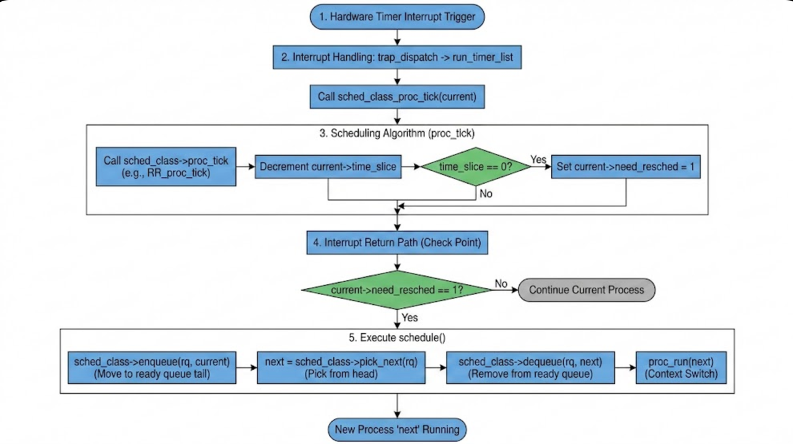
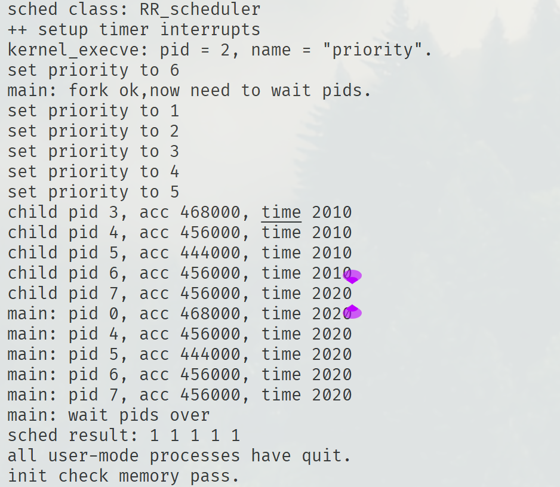

张奥喆（2313447） 余俊辉（2313486） 杨李泽（2313851）

***

# 练习1: 理解调度器框架的实现（不需要编码）

## **1. 调度器框架关键部分分析**

### **1.1 调度类结构体`sched_class`分析**

`sched_class` 结构体定义了一组函数指针，这些函数指针构成了一个调度算法的接口。通过这种方式，ucore 内核可以将具体的调度策略与调度机制解耦。

```c
struct sched_class {
    const char *name;
    void (*init)(struct run_queue *rq);
    void (*enqueue)(struct run_queue *rq, struct proc_struct *proc);
    void (*dequeue)(struct run_queue *rq, struct proc_struct *proc);
    struct proc_struct *(*pick_next)(struct run_queue *rq);
    void (*proc_tick)(struct run_queue *rq, struct proc_struct *proc);
};
```

* **`name`**: 调度类的名称，用于调试和标识。

* **`init`**: 初始化运行队列。在内核启动时调用，用于初始化调度算法所需的数据结构（如链表、堆等）。

* **`enqueue`**: 将进程加入运行队列。当一个进程变为 `PROC_RUNNABLE` 状态时（例如被创建、被唤醒、或时间片用完被抢占），该函数被调用。

* **`dequeue`**: 将进程从运行队列中移除。当一个进程被调度执行（从就绪变为运行），或者因为等待事件而阻塞（从就绪/运行变为睡眠/僵尸）时，该函数被调用。

* **`pick_next`**: 选择下一个要运行的进程。调度器核心函数 `schedule()` 会调用此函数来决定将 CPU 分配给哪个进程。

* **`proc_tick`**: 时钟中断处理函数。在每次时钟中断时被调用，用于更新当前进程的时间片或其他统计信息，并判断是否需要进行进程切换（设置 `need_resched` 标志）。

**为什么使用函数指针？**

使用函数指针实现了多态性。内核代码只需要调用 `sched_class->enqueue()`，而不需要知道具体是 Round Robin 还是 Stride 调度算法。这使得在运行时或编译时切换调度算法变得非常容易，只需改变 `sched_class` 指向的实例即可，无需修改内核核心调度逻辑。

### **1.2 运行队列结构体`run_queue`分析**

**Lab 5 vs Lab 6:**

\*   **Lab 5**: 没有显式的 `run_queue` 结构体，或者说调度逻辑比较简单，通常直接操作全局的进程链表或简单的就绪队列。在 Lab 5 的 `proc.h` 中可以看到 `proc_struct` 只有 `list_link` 和 `hash_link`，没有专门针对调度器的复杂结构。

\*   **Lab 6**: 引入了 `run_queue` 结构体。

```c
struct run_queue {
    list_entry_t run_list;
    unsigned int proc_num;
    int max_time_slice;
    // For LAB6 ONLY
    skew_heap_entry_t *lab6_run_pool;
};
```

**为什么支持两种数据结构（链表和斜堆）？**

* **链表 (`run_list`)**: 用于支持简单的调度算法，如 Round Robin (RR)。RR 只需要按顺序遍历队列，链表实现简单且高效（O(1) 的插入和删除）。

* **斜堆 (`lab6_run_pool`)**: 用于支持优先级调度算法，如 Stride Scheduling。Stride 调度需要频繁地查找 stride 值最小的进程。斜堆（Skew Heap）是一种自适应的堆结构，能够高效地（O(log N)）完成最小值的查找、插入和合并操作，非常适合用于优先级队列的实现。

通过在 `run_queue` 中同时包含这两种结构，ucore 的调度框架可以灵活地支持不同类型的调度算法，而无需为每种算法重新定义运行队列结构。

### **1.3 调度器框架函数分析**

**`sched_init()`**:

* 初始化 timer list。

* 设置默认的调度类 `sched_class = &default_sched_class` (通常是 RR)。

* 初始化运行队列 `rq`，并调用具体调度类的 `init` 函数（如 `RR_init`）。

* 这标志着调度系统的启动。

**`wakeup_proc(struct proc_struct *proc)`**:

* 将进程状态设置为 `PROC_RUNNABLE`。

* 调用 `sched_class_enqueue(proc)`，这最终会调用 `sched_class->enqueue(rq, proc)`。

* 这一步将进程真正加入到调度器的管理结构（链表或堆）中，使其有机会被调度执行。

* 实现了解耦：`wakeup_proc` 不需要知道具体的入队逻辑。

**`schedule()`**:

* 这是调度器的主循环。

* 首先，如果当前进程 `current` 仍然是 `PROC_RUNNABLE`（说明是时间片用完或被抢占，而不是阻塞），则将其重新加入运行队列 (`sched_class_enqueue`)。

* 调用 `sched_class_pick_next()` 选择下一个进程。

* 如果选出了新进程，调用 `sched_class_dequeue()` 将其从运行队列移除（表示它正在运行，不再处于就绪队列中）。

* 如果没选出（队列空），则运行 `idleproc`。

* 最后调用 `proc_run(next)` 进行上下文切换。

* **变化**: Lab 6 的 `schedule` 完全依赖 `sched_class` 的接口来决定“谁进队列”、“谁出队列”、“选谁运行”，核心逻辑变得通用。

## **2. 调度器框架的使用流程**

### **2.1 调度类的初始化流程**

1\.  **内核入口**: `kern_init` 开始执行。

2\.  **调度初始化**: `kern_init` 调用 `sched_init()`。

3\.  **绑定调度类**: 在 `sched_init` 中，`sched_class` 全局变量被指向 `default_sched_class` (在 default\_sched.c 中定义，实现了 RR 算法)。

4\.  **初始化队列**: `sched_init` 调用 `sched_class->init(rq)`。对于 RR 算法，这会调用 `RR_init`，初始化 `run_list` 为空链表，`proc_num` 为 0。

5\.  **后续**: 之后创建的进程（如 `initproc`）在被唤醒时，会通过 `wakeup_proc` -> `sched_class->enqueue` -> `RR_enqueue` 加入到这个初始化好的运行队列中。

### **2.2 进程调度流程**



**流程图描述：**

1\.  **触发**: 硬件产生时钟中断。

2\.  **中断处理**: `trap_dispatch` -> `run_timer_list` -> `sched_class_proc_tick(current)`。

3\.  **调度算法处理 (`proc_tick`)**:

* 调用 `sched_class->proc_tick(rq, current)` (例如 `RR_proc_tick`)。

* `RR_proc_tick` 减少 `current->time_slice`。

* 如果 `time_slice` 减为 0，设置 `current->need_resched = 1`。

4\.  **调度时机检查**: 中断处理即将返回用户态或内核态循环检测时，检查 `current->need_resched` 标志。

5\.  **执行调度 (`schedule`)**:

* 如果 `need_resched == 1`，调用 `schedule()`。

* `schedule()`:

  * `sched_class->enqueue(rq, current)`: 把当前进程放回就绪队列末尾。

  * `sched_class->pick_next(rq)`: 从就绪队列头部选一个进程 `next`。

  * `sched_class->dequeue(rq, next)`: 把 `next` 从就绪队列拿出来。

  * `proc_run(next)`: 切换上下文，CPU 开始执行 `next`。

**`need_resched` 的作用**:

这是一个“推迟调度”的标志。在中断处理程序中（如时钟中断），我们不能直接进行上下文切换（因为中断上下文很复杂）。相反，我们只是标记“当前进程该下台了”（`need_resched = 1`）。真正的切换操作推迟到中断处理结束、即将返回之前的执行流时，或者在内核显式调用 `schedule()` 时进行。这保证了调度的安全性和确定性。

### **2.3 调度算法的切换机制**

**如果要添加一个新的调度算法（如 Stride）：**

1\.  **定义结构体**: 创建一个新的 `struct sched_class` 实例，例如 `stride_sched_class`。

2\.  **实现接口**: 实现 `init`, `enqueue`, `dequeue`, `pick_next`, `proc_tick` 这 5 个函数，逻辑符合 Stride 算法（使用斜堆、步长计算等）。

3\.  **注册**: 在 `sched_init()` 中，将 `sched_class` 指针指向 `stride_sched_class` 而不是 `default_sched_class`。

**为什么容易切换？**

因为 ucore 采用了**面向接口编程**的思想。

* **接口统一**: 所有调度算法都必须实现 `sched_class` 定义的标准接口。

* **调用抽象**: 内核其他部分（如 `schedule`, `wakeup_proc`, 时钟中断处理）只通过 `sched_class` 指针调用接口函数，完全不依赖具体的算法实现细节。

* **数据结构支持**: `run_queue` 和 `proc_struct` 预留了通用的成员（如 `lab6_run_pool`, `lab6_stride`, `lab6_priority`），使得新算法可以直接使用这些字段，而不需要大规模修改核心数据结构。

这种设计模式使得替换调度算法就像更换一个插件一样简单。

***

# 练习2: 实现 Round Robin 调度算法（需要编码）

## Lab5 与 Lab6 中函数实现差异分析

**比较对象：`kern/schedule/sched.c` 中的 `schedule()` 函数**

Lab5 中的实现：

```c
void schedule(void)
{
    bool intr_flag;
    list_entry_t *le, *last;
    struct proc_struct *next = NULL;
    local_intr_save(intr_flag);
    {
        current->need_resched = 0;
        last = (current == idleproc) ? &proc_list : &(current->list_link);
        le = last;
        do
        {
            if ((le = list_next(le)) != &proc_list)
            {
                next = le2proc(le, list_link);
                if (next->state == PROC_RUNNABLE)
                {
                    break;
                }
            }
        } while (le != last);
        if (next == NULL || next->state != PROC_RUNNABLE)
        {
            next = idleproc;
        }
        next->runs++;
        if (next != current)
        {
            proc_run(next);
        }
    }
    local_intr_restore(intr_flag);
}
```

Lab6 中的实现：

```c
void schedule(void)
{
    bool intr_flag;
    struct proc_struct *next;
    local_intr_save(intr_flag);
    {
        current->need_resched = 0;
        if (current->state == PROC_RUNNABLE)
        {
            sched_class_enqueue(current);
        }
        if ((next = sched_class_pick_next()) != NULL)
        {
            sched_class_dequeue(next);
        }
        if (next == NULL)
        {
            next = idleproc;
        }
        next->runs++;
        if (next != current)
        {
            proc_run(next);
        }
    }
    local_intr_restore(intr_flag);
}
```

**改动对比：**

| 对比项       | Lab5                 | Lab6                        |
| --------- | -------------------- | --------------------------- |
| **调度方式**  | 直接遍历进程链表 `proc_list` | 通过调度器类接口操作运行队列              |
| **队列管理**  | 无专门的运行队列             | 使用 `run_queue` 结构体管理就绪进程    |
| **时间片支持** | 无时间片概念               | 支持时间片轮转                     |
| **扩展性**   | 硬编码的调度逻辑             | 通过 `sched_class` 接口支持多种调度算法 |

**为什么要做这个改动：**

1. **模块化设计**：Lab6 引入了调度器框架（`sched_class`），将调度算法的具体实现与调度器核心逻辑分离。这使得更换调度算法只需要实现相应的调度器类，而不需要修改核心调度代码。

2. **运行队列管理**：Lab5 的 `schedule()` 直接遍历所有进程查找可运行进程，效率较低。Lab6 引入了专门的运行队列 `run_queue`，只管理处于就绪态的进程，提高了调度效率。

3. **时间片支持**：Lab6 需要支持时间片轮转调度，必须将当前进程重新入队（如果仍可运行），这在 Lab5 的实现中是不存在的。

4. **当前进程的处理**：Lab6 的改动增加了 `sched_class_enqueue(current)` 的调用，这是 RR 调度的关键——当进程时间片用完后，需要将其放回队尾等待下一轮调度。

**不做这个改动会出什么问题：**

* 无法实现时间片轮转：进程一旦获得 CPU，只有在主动放弃或阻塞时才会切换

* 无法支持多种调度算法：调度逻辑硬编码在 `schedule()` 中

* 效率低下：每次调度都需要遍历全部进程

* 无法正确管理进程的就绪状态：没有独立的运行队列

***

## RR 调度算法函数实现详解

### RR\_init 函数

```c
static void
RR_init(struct run_queue *rq)
{
    // LAB6: 2313447
    // 初始化运行队列
    list_init(&(rq->run_list));  // 初始化运行队列链表为空
    rq->proc_num = 0;            // 初始化进程数量为 0
}
```

**实现思路**：初始化运行队列的链表头 `run_list`，使其成为一个空的双向循环链表；将进程计数器 `proc_num` 设置为 0。

**链表操作选择**：使用 `list_init()` 初始化链表头，这会使链表的 `prev` 和 `next` 都指向自身，表示空链表。

**边界条件处理**：初始化时队列必然为空，不需要特殊处理。

***

### RR\_enqueue 函数

```c
static void
RR_enqueue(struct run_queue *rq, struct proc_struct *proc)
{
    // LAB6: 2313447
    assert(list_empty(&(proc->run_link)));  // 确保进程不在任何队列中
    
    // 将进程插入到运行队列的尾部
    list_add_before(&(rq->run_list), &(proc->run_link));
    
    // 如果进程的时间片已用完或超过最大时间片，重置为最大时间片
    if (proc->time_slice == 0 || proc->time_slice > rq->max_time_slice) {
        proc->time_slice = rq->max_time_slice;
    }
    
    // 设置进程所属的运行队列
    proc->rq = rq;
    
    // 更新运行队列中的进程数量
    rq->proc_num++;
}
```

**实现思路**：

1. 使用断言确保进程当前不在任何队列中（防止重复入队）

2. 将进程插入到运行队列的**尾部**，实现 FIFO 顺序

3. 处理时间片：如果时间片用完或无效，重置为最大时间片

4. 记录进程所属的运行队列

5. 更新队列中的进程计数

**链表操作选择**：使用 `list_add_before(&(rq->run_list), ...)` 将元素插入到链表头的**前面**。由于是循环链表，链表头的前面就是队尾，这样实现了插入队尾的效果。

```plaintext
队列结构示意图：
run_list <-> proc1 <-> proc2 <-> proc3 <-> run_list
  头节点      队首                  队尾      头节点
```

**边界条件处理**：`time_slice == 0` 表示进程时间片用完，需要重置；`time_slice > max_time_slice` 为异常情况，也需要重置为合法值。

***

### RR\_dequeue 函数

```c
static void
RR_dequeue(struct run_queue *rq, struct proc_struct *proc)
{
    // LAB6: 2313447
    assert(!list_empty(&(proc->run_link)));  // 确保进程在队列中
    
    // 从运行队列中删除该进程
    list_del_init(&(proc->run_link));
    
    // 更新运行队列中的进程数量
    rq->proc_num--;
}
```

**实现思路**：使用断言确保进程确实在队列中；将进程从运行队列中删除；更新进程计数。

**链表操作选择**：使用 `list_del_init()` 而非 `list_del()`。`list_del_init()` 在删除节点后会将其 `prev` 和 `next` 指向自身，使其成为一个空链表节点，这样可以通过 `list_empty()` 检查进程是否在队列中。

**边界条件处理**：断言确保不会对不在队列中的进程执行删除操作。

***

### RR\_pick\_next 函数

```c
static struct proc_struct *
RR_pick_next(struct run_queue *rq)
{
    // LAB6: 2313447
    // 获取运行队列的第一个元素（队首）
    list_entry_t *le = list_next(&(rq->run_list));
    
    // 如果队列为空，返回 NULL
    if (le != &(rq->run_list)) {
        // 使用 le2proc 宏将链表节点转换为进程控制块指针
        return le2proc(le, run_link);
    }
    return NULL;
}
```

**实现思路**：获取链表头的下一个节点（即队首元素）；判断队列是否为空；使用 `le2proc` 宏将链表节点转换为进程指针。

**链表操作选择**：使用 `list_next()` 获取队首元素。RR 调度总是选择队首进程，保证公平性。

**le2proc 宏说明**：`le2proc(le, run_link)` 根据链表节点 `le` 的地址，计算出包含该节点的 `proc_struct` 结构体的地址，`run_link` 是 `proc_struct` 中存储链表节点的成员名。

**边界条件处理**：空队列检测 `le == &(rq->run_list)` 表示队列为空，返回 NULL 让调用者知道没有可调度的进程。

***

### RR\_proc\_tick 函数

```c
static void
RR_proc_tick(struct run_queue *rq, struct proc_struct *proc)
{
    // LAB6: 2313447
    // 如果进程的时间片大于 0，减少时间片
    if (proc->time_slice > 0) {
        proc->time_slice--;
    }
    
    // 如果时间片用完，设置需要调度标志
    if (proc->time_slice == 0) {
        proc->need_resched = 1;
    }
}
```

**实现思路**：每次时钟中断时减少当前进程的时间片；当时间片用完时，设置 `need_resched` 标志。

**边界条件处理**：`time_slice > 0` 检查防止时间片变成负数；分离两个 if 语句确保逻辑清晰。

***

## make grade 测试结果


**调度现象观察**：在 QEMU 中运行时，可以观察到时间片轮转现象。在 `spin` 测试中，多个进程会交替执行，每个进程运行一定时间片后被切换。进程按照 0, 1, 2... 的顺序轮流执行，体现了 RR 调度的公平性。当没有就绪进程时，系统会切换到 idle 进程。



从输出可以看到，各子进程的累计执行时间（acc）和完成时间（time）非常接近，这体现了 RR 调度算法的公平性特点——所有进程获得的 CPU 时间片基本相同，不会因为优先级不同而产生明显差异。

***

## Round Robin 调度算法分析

**优缺点对比：**

| 类型              | 说明                           |
| --------------- | ---------------------------- |
| **优点 - 公平性**    | 所有进程获得相同的 CPU 时间片，不会出现饥饿现象   |
| **优点 - 响应性**    | 每个进程在有限时间内都能获得 CPU，系统响应时间可预测 |
| **优点 - 实现简单**   | 只需要一个 FIFO 队列和时间片计数器         |
| **优点 - 无需先验知识** | 不需要知道进程的运行时间或优先级             |

| **缺点 - 无优先级区分**   | 重要进程和普通进程获得相同的时间片      |
| ----------------- | ---------------------- |
| **缺点 - 上下文切换开销**  | 频繁的进程切换会带来额外开销         |
| **缺点 - 时间片难以优化**  | 不同类型的进程可能需要不同的时间片      |
| **缺点 - 平均等待时间较高** | 与 SJF 等算法相比，平均等待时间可能更长 |

**时间片大小优化**：当前实现中 `MAX_TIME_SLICE = 5`，时间片大小的选择需要权衡：

* **较小时间片**：响应时间短，交互性好，但上下文切换频繁，开销大

* **较大时间片**：上下文切换少，吞吐量高，但响应时间长，交互性差

优化建议：交互式系统使用较小的时间片（如 10-20ms）保证响应性；批处理系统使用较大的时间片（如 100-200ms）提高吞吐量；也可以根据系统负载动态调整时间片大小。

**need\_resched 标志的作用**：在 `RR_proc_tick` 中设置 `need_resched` 标志而非直接调用 `schedule()` 的原因：

1. **延迟调度**：时钟中断处理程序中不应直接调用 `schedule()`，因为中断上下文中进行完整的上下文切换可能导致问题

2. **标志检查点**：`need_resched` 标志会在中断返回前和系统调用返回前被检查

3. **协调机制**：这个标志作为时钟中断处理程序和调度器之间的协调机制

***

## 拓展思考

**优先级 RR 调度实现**：要实现优先级 RR 调度，需要进行以下修改：

数据结构方面，需要在 `proc_struct` 中添加优先级字段，修改 `run_queue` 使用多级队列或优先级堆：

```c
struct run_queue {
    list_entry_t run_list[MAX_PRIORITY];  // 多级队列
    unsigned int proc_num;
    int max_time_slice;
};
```

函数修改方面，`RR_enqueue` 需要根据优先级插入到相应的队列，`RR_pick_next` 需要从最高优先级非空队列中选择进程。还可以在 `proc_tick` 中实现老化机制，防止低优先级进程饥饿。

**多核调度支持**：当前实现不支持多核调度，主要问题包括：

* 共享数据结构：`run_queue` 是全局共享的，多核同时访问会产生竞争

* 无核心亲和性：没有考虑进程与特定 CPU 核心的绑定

* 无负载均衡：没有在多个核心之间分配进程的机制

改进方案：

1. 每个 CPU 核心一个运行队列 `per_cpu_rq[NR_CPUS]`

2. 添加自旋锁保护 `run_queue` 结构

3. 实现 `sched_class` 中预留的 SMP 支持接口（`load_balance`、`get_proc`）

4. 在进程结构中添加 CPU 亲和性字段

5. 实现周期性负载均衡，将进程从繁忙 CPU 迁移到空闲 CPU

***

# 实验知识点与操作系统原理知识点的对应与分析

## 本实验中重要的知识点及其与 OS 原理的对应关系

### 1. 机制与策略的分离

* **OS 原理**：操作系统设计中的核心原则之一。调度机制（如何切换进程、如何维护队列）应该与调度策略（选择哪一个进程运行）分离开来，以便于灵活替换不同的算法。

* **实验对应**：

  * 在 `kern/schedule/sched.c` 中实现了通用的调度器框架，它并不关心具体的算法细节。

  * 通过 `struct sched_class` 结构体（定义在 `kern/schedule/sched.h`）定义了一组函数指针接口（如 `init`, `enqueue`, `dequeue`, `pick_next`, `proc_tick`）。

  * 具体的算法（如 `default_sched.c` 中的 RR 或 Stride 算法）只需要实现这些接口。这完美体现了机制（`sched.c`）与策略（`sched_class` 具体实现）的分离。

### 2. 时间片轮转调度

* **OS 原理**：RR 算法是分时系统的基础。它通过给每个进程分配固定的时间片（Time Quantum/Slice），防止某个进程长期占用 CPU，从而保证系统的响应时间。

* **实验对应**：

  * **时间片消耗**：在 `trap_dispatch` 响应时钟中断时，会调用 `sched_class_proc_tick`。在 `default_sched.c` 的 `RR_proc_tick` 函数中，每次时钟中断将 `proc->time_slice` 减一。

  * **被动调度**：当 `time_slice` 减为 0 时，设置 `proc->need_resched = 1`，标志该进程需要被调度出去，从而实现抢占。

### 3. 进程上下文切换

* **OS 原理**：当调度器决定切换进程时，必须保存当前进程的执行状态（寄存器、栈指针等），并恢复新进程的状态，使新进程仿佛从未被打断过一样继续执行。

* **实验对应**：

  * `schedule()` 函数最终会调用 `proc_run()`。

  * 核心汇编代码在 `kern/process/switch.S` 中，`switch_to` 函数负责保存当前进程的上下文到其 PCB（`context` 结构体）中，并将 CPU 寄存器加载为新进程的上下文。这是实现并发执行的物理基础。

### 4. 临界区与原子操作

* **OS 原理**：调度器本身的数据结构（如运行队列）是内核的关键共享资源。在操作这些结构时，必须屏蔽中断以防止竞态条件。

* **实验对应**：

  * 在 `schedule()` 函数开始执行时，通常需要通过 `local_intr_save(intr_flag)` 关中断。

  * 这对应了并发控制原理中，在单处理器系统中通过**关中断**来保护内核临界区的做法，确保 `pick_next` 和队列操作的原子性。

## OS 原理中很重要，但在实验中没有对应上的知识点

虽然 Lab6 搭建了一个完整的调度框架，但受限于 uCore 的教学性质和简化设计，现代商业操作系统中一些关键的调度和并发概念并未包含在内：

### 1. 多级反馈队列

* **缺失分析**：实际 OS（如 Unix BSD, Windows）通常使用 MLFQ。它能够自动区分 I/O 密集型和 CPU 密集型进程（通过动态调整优先级和不同层级队列的时间片大小）。

* **实验现状**：Lab6 目前只实现了单一的队列结构。

### 2. 多处理器调度

* **缺失分析**：现代服务器和 PC 均是多核环境。SMP 调度涉及**负载均衡**、**处理器亲和性**以及**每 CPU 运行队列**的锁竞争问题。

* **实验现状**：uCore Lab6 是针对单 CPU 设计的。全局只有一个 `run_queue`，不存在跨 CPU 迁移进程的问题，也不涉及复杂的细粒度锁（如自旋锁）来保护每个 CPU 的队列。
